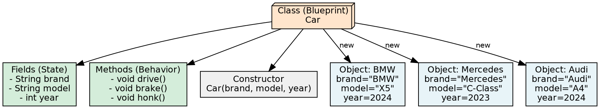
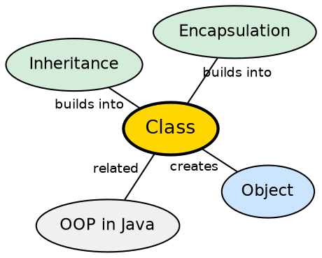

## The Problem

Without classes, each object would need to be defined individually, with its own set of properties and methods copied from scratch. Writing code for every object separately leads to massive duplication — every BMW, Mercedes, and Audi would need its own implementation of drive(), brake(), and honk() even though they share the same behavior.

## Core Idea

A **class** is a user-defined blueprint or prototype from which objects are created. It represents the set of properties (fields) and methods (behavior) that are common to all objects of one type. Using classes, you can create multiple objects with the same behavior instead of writing their code multiple times. A class bundles state and behavior into a single logical unit.

## How It Works

A class declaration includes three components in order: **modifiers** (public, default access), **class name** (convention: capitalized first letter), and **body** (fields, methods, constructors surrounded by braces). When the JVM loads a class, it creates a `Class` object in the method area that serves as the runtime type information. The `new` keyword allocates heap memory based on the class blueprint, calling the constructor to initialize fields.

## Visual Explanation

## Semantic Network

## Key Properties

- **Blueprint**: Defines the structure and behavior of objects created from it
- **Modular**: Groups related state and behavior into a single unit
- **Reusable**: One class definition creates any number of unique object instances
- **Convention**: Class names begin with uppercase letter by convention (e.g., Car, Animal)
- **Default constructor**: Java provides a no-arg constructor if none is defined explicitly

## Connections

- **Builds into:** [[java-object|Java Object]] — a class is instantiated to create objects
- **Built from:** [[java-constructors|Java Constructors]] — constructors initialize new class instances
- **Builds into:** [[java-inheritance|Java Inheritance]] — subclasses extend a parent class
- **Related:** [[java-oop-pillars|The Four OOP Pillars]] — classes are the foundation of all four OOP pillars

## Edge Cases & Gotchas

- **One public class per file**: A .java file can have at most one public top-level class
- **Nested classes**: Inner classes, static nested classes, local classes, and anonymous classes have different rules
- **Default constructor disappears**: If you define any constructor, the default no-arg constructor is not provided
- **Class name vs filename**: The public class name must match the filename (case-sensitive on case-sensitive systems)