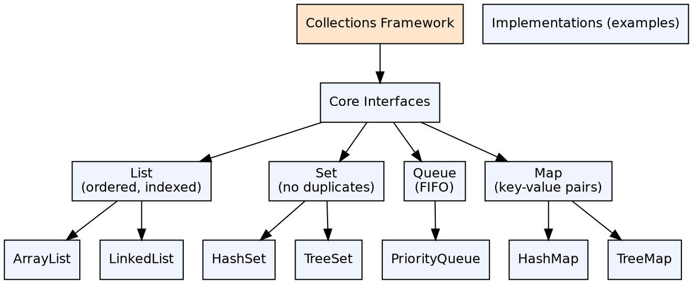
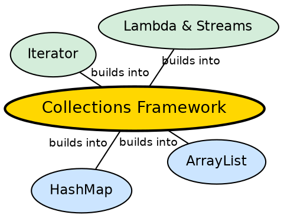

## The Problem

Every application manages groups of objects — storing them, searching through them, sorting them, iterating over them. Without a standardized collection framework, every developer would reinvent data structures, leading to incompatible APIs, inconsistent behavior, and wasted effort.

## Core Idea

The **Java Collections Framework** is a unified architecture for representing and manipulating collections. It provides interfaces (`List`, `Set`, `Queue`, `Deque`, `Map`), implementations (`ArrayList`, `HashSet`, `HashMap`, `LinkedList`, `TreeSet`, `PriorityQueue`), and utility classes (`Collections`, `Arrays`).

## How It Works

The framework is interface-centric. Code written against interfaces (`List`, `Set`, `Map`) works with any implementation. Each implementation has different performance characteristics. The `Collections` utility class provides algorithms (sort, shuffle, reverse, binarySearch) that work on any appropriate collection type.

## Visual Explanation

## Semantic Network

## Key Properties

- **Interface-based design**: Code to interfaces, not implementations
- **Autoboxing integration**: Collections work with wrapper classes, autoboxing handles primitives
- **Fail-fast iterators**: Detect concurrent modification and throw `ConcurrentModificationException`
- **Synchronized wrappers**: `Collections.synchronizedList()` creates thread-safe wrappers

## Connections

- **Built from:** [[java-wrapper-classes|Java Wrapper Classes]] — collections store objects, wrappers bridge primitives
- **Built from:** [[java-interfaces|Java Interfaces]] — the framework is interface-driven
- **Builds into:** [[java-lambda-and-streams|Streams & Lambdas]] — streams operate on collections
- **Builds into:** [[java-iterator|Iterator]] — iterator is the fundamental traversal mechanism

## Edge Cases & Gotchas

- **ConcurrentModificationException**: Modifying a collection while iterating (except via iterator.remove())
- **No primitive collections**: Each element requires a wrapper object — memory overhead
- **Hash collision performance**: HashMap degrades to O(n) with bad hash codes or hash collisions
- **Null handling**: Some implementations (TreeSet, TreeMap) do not allow null elements

## Sources

- [[java1-summary|Java Tutorial — Source Summary]] — collections framework
