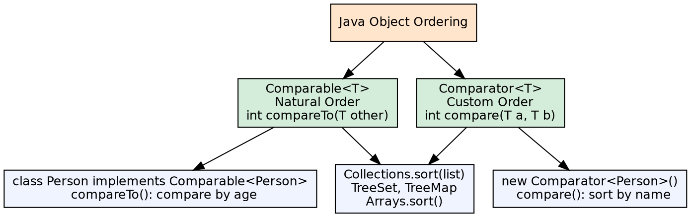
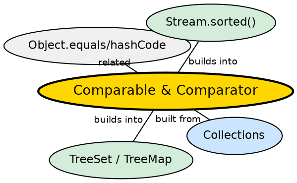

## The Problem

Sorting and ordered collections (TreeSet, TreeMap) need to determine the relative order of objects. Without a standard way to compare objects, the JVM would have no idea how to sort a list of custom objects or maintain order in a sorted collection.

## Core Idea

**Comparable** defines a natural ordering for objects of a class — the class implements `Comparable<T>` and overrides `compareTo()`. **Comparator** is a separate interface for defining custom orderings — useful when you need multiple sorting strategies or cannot modify the class.

## How It Works

`Comparable.compareTo(other)` returns negative (this < other), zero (this == other), or positive (this > other). Sorted collections (TreeSet, TreeMap) and utility methods (`Collections.sort()`, `Arrays.sort()`) use compareTo() by default. A `Comparator` can be passed to override the natural order.

## Visual Explanation

## Semantic Network

## Key Properties

- **Consistent with equals**: Natural ordering should be consistent with equals (or document if not)
- **Comparator methods** (Java 8+): `Comparator.comparing()`, `thenComparing()`, `reversed()` for fluent construction
- **null handling**: Comparators can handle nulls via `nullsFirst()` and `nullsLast()`
- **Sorting stability**: Java's sorting algorithms (TimSort, Dual-Pivot QuickSort) are stable

## Connections

- **Built from:** [[java-collections-framework|Java Collections Framework]] — sorted collections require comparison
- **Builds into:** [[java-collections-framework|Java Collections Framework]] — TreeSet and TreeMap use Comparable/Comparator for sorting
- **Contrasts with:** [[java-iterator|Java Iterator]] — Comparable defines ordering; Iterator defines traversal

## Edge Cases & Gotchas

- **compareTo must be transitive**: If a > b and b > c, then a > c must hold
- **compareTo must be reflexive**: a.compareTo(a) must return 0
- **compareTo consistency with equals**: Inconsistent classes break Set/Map contracts
- **compare returns int**: Overflow risk when subtracting values — use `Integer.compare()` instead