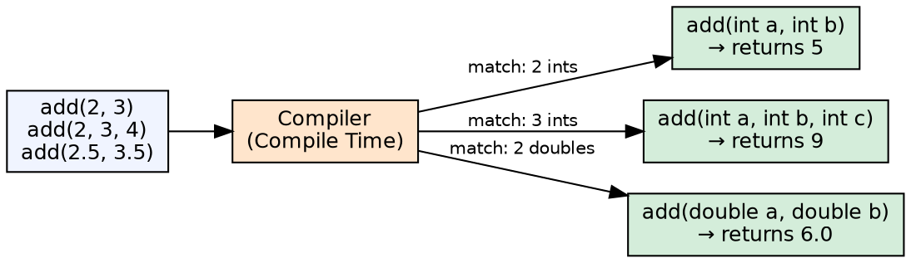
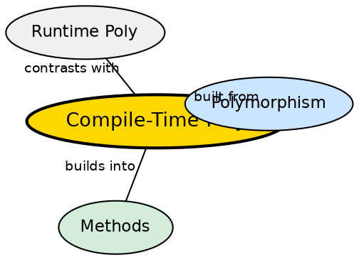

## The Problem

A class often needs multiple versions of the same operation that differ only in their inputs. A `print()` method should work with integers, strings, and booleans. Without overloading, each variant would need a distinct method name (printInt, printString, printBool), making the API inconsistent and hard to remember.

## Core Idea

**Compile-time Polymorphism** (also called **Method Overloading**) allows multiple methods in the same class to share the same name but have different parameter lists. The compiler determines which version to call based on the number, type, and order of arguments. This decision is made at compile time — hence the name. Overloading improves code readability by using consistent names for logically similar operations.

## How It Works

The compiler uses the method signature (name + parameter types) to select the correct overload. It applies widening conversions, autoboxing, and varargs in that order of preference. If no matching overload is found, a compile error occurs. Overloaded methods can differ in parameter count, parameter types, or both. Return type alone is NOT sufficient for overloading — the compiler needs parameter differences.

## Visual Explanation

## Semantic Network

## Key Properties

- **Same name, different parameters**: Number, type, or order of parameters must differ
- **Compile-time resolution**: Which method to call is decided when code is compiled
- **Return type alone is insufficient**: Methods differing only in return type cause compile error
- **Widening preferred over boxing**: Java prefers widening (int → double) over autoboxing (int → Integer)
- **Varargs is last resort**: If no exact match is found, varargs is used as fallback

## Connections

- **Built from:** [[java-polymorphism|Java Polymorphism]] — compile-time polymorphism is one of two polymorphism types
- **Contrasts with:** [[java-runtime-polymorphism|Runtime Polymorphism]] — compile-time vs runtime resolution
- **Related:** [[java-methods|Java Methods]] — overloading is a method-level feature
- **Related:** [[java-overloading-vs-overriding|Overloading vs Overriding]] — synthesis comparing the two

## Edge Cases & Gotchas

- **Ambiguous call**: If two overloads are equally applicable (e.g., `method(Integer)` and `method(String)` with `null`), the compiler reports ambiguity
- **Widening + boxing chain**: Widening followed by boxing is not supported — `int` cannot widen then autobox to `Long`
- **Varargs ambiguity**: Overloading with varargs can create ambiguous calls — the compiler cannot distinguish `method(int...)` from `method(Integer...)` with `null`