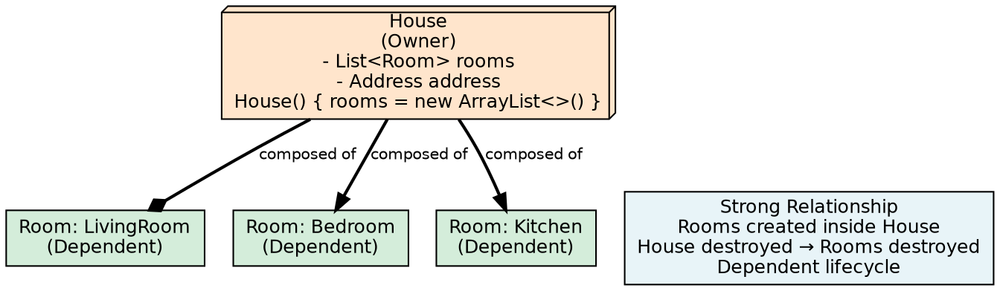
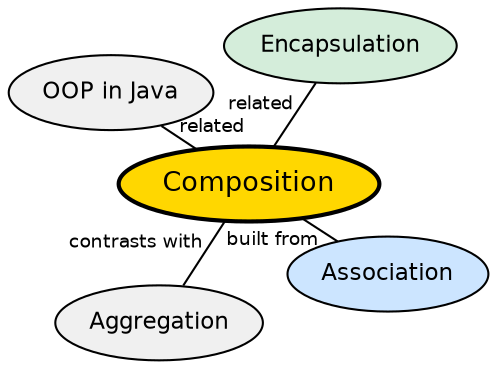

## The Problem

Some objects are inherently composed of parts that have no meaning outside the whole. A House is made of Rooms — if the house is destroyed, the rooms cease to exist as meaningful entities. Without composition, modeling these inseparable whole-part relationships would require manual lifecycle management across unrelated objects.

## Core Idea

**Composition** is a strong form of association where one class owns another class. If the parent object is destroyed, the child object also gets destroyed. It represents an **"is-part-of"** relationship with dependent lifecycles — the child cannot exist independently of the parent. Composition is the strongest form of class relationship in Java.

## How It Works

Composition is implemented by creating the contained object inside the container's constructor. The contained object is exclusively owned by the container — no external references to it exist. When the container is garbage collected, the contained object becomes unreachable and is also eligible for GC. In UML, composition is denoted by a filled diamond on the container side. The lifecycle is strictly bound: parent creates child, parent destroys child.

## Visual Explanation

## Semantic Network

## Key Properties

- **Strong relationship**: Parent owns child exclusively
- **Dependent lifecycles**: Child cannot exist without parent
- **Exclusive ownership**: Child object is owned by exactly one parent
- **Internal creation**: Child objects are typically created inside the parent's constructor
- **UML notation**: Filled diamond on the container side

## Connections

- **Built from:** [[java-association|Java Association]] — composition is the strongest form of association
- **Contrasts with:** [[java-aggregation|Java Aggregation]] — aggregation has independent lifecycles; composition has dependent lifecycles
- **Related:** [[java-aggregation-vs-composition|Aggregation vs Composition]] — synthesis comparing the two
- **Related:** [[java-encapsulation|Java Encapsulation]] — composition relies on encapsulation to hide internal parts

## Edge Cases & Gotchas

- **Cloning and copy**: Deep cloning a composed object means cloning all child parts — shallow copy shares references to children
- **Circular composition**: A Room cannot contain a House that contains the same Room — this creates reference cycles
- **Composition vs Aggregation in code**: The difference is in object creation — if created externally and passed in, it's aggregation; if created in the constructor, it's composition
- **Serialization**: Serializing a composed object serializes all its parts; deserialization reconstructs the entire graph

## Sources

- [[java2-summary|Java OOP Concepts — Source Summary]] — composition as strong association, House/Rooms example
