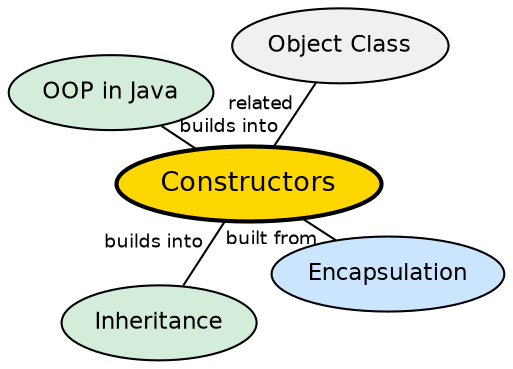

## The Problem

When an object is created, its fields need to be initialized to a valid state. Without constructors, developers would need to manually call an initialization method after every `new` — an error-prone pattern that could be forgotten, leading to objects in invalid states.

## Core Idea

A **constructor** is a special method that initializes a newly created object. It has the same name as the class, has no return type, and is called automatically when `new` is used. Java supports **constructor overloading** (multiple constructors with different parameters), default constructors (compiler-generated if none are defined), and constructor chaining with `this()` and `super()`.

## How It Works

When `new` is executed, the JVM allocates memory for the object on the heap, initializes fields to defaults (0, null, false), then calls the constructor. The constructor can set fields, validate parameters, call other constructors via `this()`, or call the parent constructor via `super()`.

## Visual Explanation

```dot
digraph java_constructors {
  rankdir=TB
  node [shape=box style=filled fillcolor="#f0f4ff" fontname="Helvetica" fontsize=12]
  edge [fontname="Helvetica" fontsize=10]

  New [label='new Person("Alice", 30)']
  Alloc [label="JVM allocates\nheap memory" fillcolor="#ffe5cc"]
  Init [label="Fields defaulted\nto 0 / null / false"]
  Constr [label="Constructor called\nPerson(String, int)" fillcolor="#d4edda"]
  Object [label="Fully initialized\nPerson object"]

  New -> Alloc
  Alloc -> Init
  Init -> Constr
  Constr -> Object
}
```

## Semantic Network



## Key Properties

- **No return type**: Not even `void` — constructors are not methods
- **Default constructor**: Automatic only if no constructor is defined
- **Chaining**: `this()` calls another constructor in the same class; `super()` calls the parent constructor
- **Overloading**: Multiple constructors with different parameter lists

## Connections

- **Built from:** [[java-inheritance|Java Inheritance]] — constructor chaining via super() enables parent initialization
- **Built from:** [[java-object-class|Java Object Class]] — every constructor implicitly calls super()
- **Builds into:** [[java-inheritance|Java Inheritance]] — constructor chaining with super() enables parent initialization
- **Contrasts with:** [[java-methods|Java Methods]] — constructors have no return type and different invocation semantics

## Edge Cases & Gotchas

- **Private constructor**: Prevents instantiation (utility classes, singletons)
- **Constructor in enum**: Always private — cannot create enum instances externally
- **Default field values**: Instance fields initialize to defaults before constructor body runs
- **final fields**: Must be assigned by the end of every constructor (or compile error)