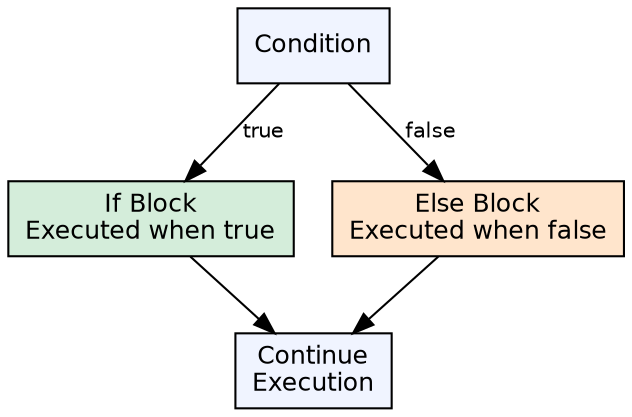
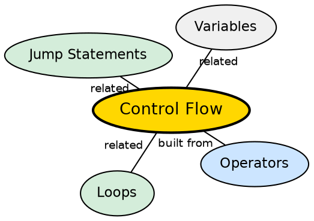

## The Problem

Programs rarely execute in a straight line from start to finish. They need to make decisions based on conditions — handle different inputs, validate states, choose between algorithms. Without control flow constructs, every program would be a single fixed sequence of operations.

## Core Idea

Java provides **decision-making constructs** that allow the program to execute different code paths based on boolean conditions. The primary constructs are `if`, `if-else`, `if-else if-else` chains, and `switch` statements. These evaluate a condition and branch to the matching code block.

## How It Works

The `if` statement evaluates a boolean expression. If true, the associated block executes; if false, execution moves to the `else` block (if present) or continues after the `if` construct. The `switch` statement evaluates an expression and jumps to the matching `case` label using a jump table (or lookup switch in the JVM). Each case must end with `break` to prevent fall-through.

## Visual Explanation

## Semantic Network

## Key Properties

- **Boolean-only conditions**: Unlike C/C++, only boolean expressions are valid in conditions
- **Switch supports**: `int`, `char`, `String` (Java 7+), and enums
- **Enhanced switch** (Java 14+): Arrow syntax with no fall-through
- **Ternary operator**: `condition ? valueIfTrue : valueIfFalse` as an expression

## Connections

- **Built from:** [[java-operators|Java Operators]] — relational and logical operators produce the boolean conditions
- **Builds into:** [[java-loops|Java Loops]] — loops also use boolean conditions for termination
- **Contrasts with:** [[java-loops|Java Loops]] — branching (if-else) vs repetition (loops) are complementary control structures
- **Related:** [[java-methods|Java Methods]] — methods encapsulate control flow into reusable units

## Edge Cases & Gotchas

- **Dangling else**: `else` binds to the nearest unmatched `if`
- **Switch fall-through**: Missing `break` causes execution to continue into the next case
- **String switch compiles differently**: JVM uses hashCode + equals under the hood
- **Ternary nesting**: Nested ternaries reduce readability — prefer if-else for complex conditions

## Sources

- [[java1-summary|Java Tutorial — Source Summary]] — decision-making constructs
