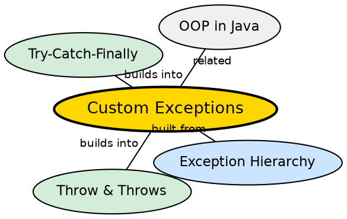

## The Problem

Built-in exception types (IOException, NullPointerException) cover system-level and general errors but cannot capture domain-specific failures. A banking application needs `InsufficientFundsException`, not a generic `IllegalArgumentException`. Without custom exceptions, error handling becomes vague and loses business context.

## Core Idea

**Custom exceptions** are user-defined classes that extend `Exception` (for checked) or `RuntimeException` (for unchecked). They carry domain-specific information — error codes, field names, additional context — enabling precise error handling and meaningful error messages.

## How It Works

A custom exception class extends `Exception` or `RuntimeException`, provides constructors, and optionally adds custom fields and methods. When thrown, it behaves like any other exception — it can be caught by type, propagated via `throws`, and chained to other exceptions.

## Visual Explanation

```dot
digraph java_custom_exceptions {
  rankdir=TB
  node [shape=box style=filled fillcolor="#f0f4ff" fontname="Helvetica" fontsize=12]
  edge [fontname="Helvetica" fontsize=10]

  Base [label="Exception (or RuntimeException)" fillcolor="#ffe5cc"]
  Custom [label="InsufficientFundsException\n- double balance\n- double requested\n- String accountId"]
  Throw [label='throw new\nInsufficientFundsException(bal, req)']
  Catch [label="catch (InsufficientFundsException e)\ne.getBalance()\ne.getRequested()" fillcolor="#d4edda"]

  Custom -> Base [label="extends"]
  Throw -> Custom
  Catch -> Throw [label="caught by type"]
}
```

## Semantic Network



## Key Properties

- **Checked vs unchecked choice**: Extend `Exception` for recoverable business errors; `RuntimeException` for programming mistakes
- **Constructors**: Typically provide no-arg, message, cause, and all-combined constructors
- **Custom fields**: Add domain data (error codes, entity IDs) for richer handling
- **Serializable**: Exception implements Serializable — custom fields should be serializable too

## Connections

- **Built from:** [[java-exception-hierarchy|Java Exception Hierarchy]] — custom exceptions extend Exception or RuntimeException
- **Built from:** [[java-throw-throws|Throw and Throws]] — custom exceptions are thrown with `throw`
- **Builds into:** [[java-jdbc|Java JDBC]] — database layers define SQLException subtypes or wrap them in custom exceptions
- **Related:** [[java-try-catch-finally|Try-Catch-Finally]] — custom exceptions are caught like any other

## Edge Cases & Gotchas

- **Serialization UID**: Always define `serialVersionUID` to avoid InvalidClassException across versions
- **Too many exception types**: Proliferating custom exceptions creates maintenance burden
- **Wrapper exceptions**: Throwing custom exception wrapping the original cause preserves the stack trace
- **Checked exception fatigue**: Overusing checked custom exceptions makes APIs painful to use