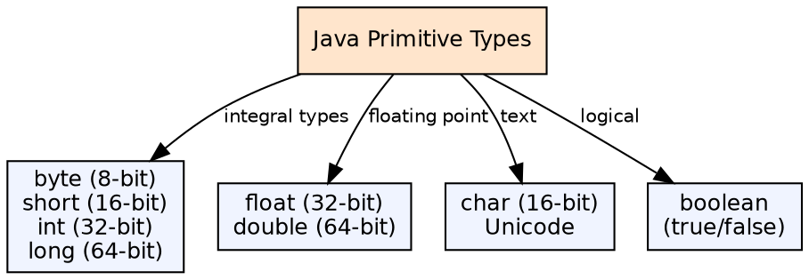
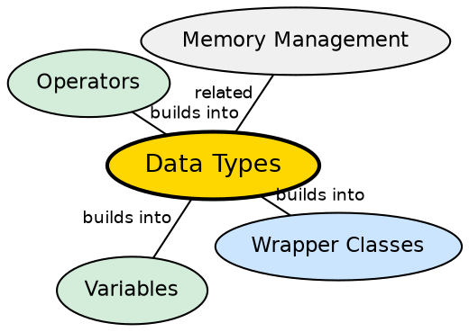

## The Problem

Every value in a program occupies memory, and the compiler needs to know how much space to allocate and how to interpret the bits. Without a type system, the same 32 bits could represent an integer, a floating-point number, or four characters — leading to errors, portability issues, and unpredictable behavior across platforms.

## Core Idea

Java has eight **primitive data types**: `byte`, `short`, `int`, `long`, `float`, `double`, `boolean`, and `char`. Each has a fixed size and range that is platform-independent, guaranteeing the same behavior on any JVM. All other types are reference types (objects and arrays).

## How It Works

When a variable of a primitive type is declared, the JVM allocates exactly the specified number of bytes for it (e.g., 4 bytes for `int`). Primitives are stored directly on the stack (for local variables) or inline in objects (for fields). They are passed by value — a copy is made. Operations on primitives map directly to CPU instructions, making them faster than objects.

## Visual Explanation

## Semantic Network

## Key Properties

- **Fixed sizes across all platforms**: `int` is always 32 bits, `long` always 64 bits
- **Signed integers**: `byte`, `short`, `int`, `long` are all signed (no unsigned primitives until Java 8)
- **IEEE 754 floats**: `float` and `double` follow the IEEE 754 standard
- **char is unsigned 16-bit**: Represents Unicode code units, not ASCII

## Connections

- **Built from:** [[java-platform-independence|Java Platform Independence]] — fixed sizes across platforms are a key part of WORA
- **Builds into:** [[java-wrapper-classes|Java Wrapper Classes]] — each primitive has a corresponding wrapper type
- **Builds into:** [[java-variables|Java Variables]] — every variable has a declared type
- **Related:** [[java-memory-management|Java Memory Management]] — primitives vs objects have different memory layouts

## Edge Cases & Gotchas

- **No unsigned primitives** for `byte`, `short`, `int`, `long` until Java 8 introduced unsigned API methods
- **char != byte**: char is 16-bit Unicode, not a single byte
- **Floating-point precision**: `float` has ~7 decimal digits, `double` has ~15 — rounding errors are common
- **Division by zero**: Integer types throw `ArithmeticException`; floating-point returns Infinity or NaN