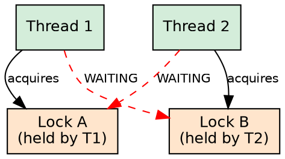
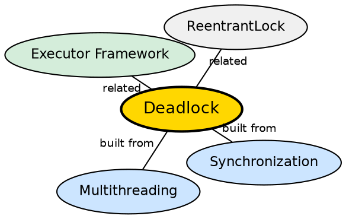

## The Problem

When multiple threads need multiple locks, they can get stuck waiting for each other indefinitely. Thread A holds lock 1 and waits for lock 2, while Thread B holds lock 2 and waits for lock 1. Neither can proceed — they are permanently blocked.

## Core Idea

**Deadlock** occurs when two or more threads are each waiting for locks held by the others, and none can proceed. The four necessary conditions are: mutual exclusion, hold-and-wait, no preemption, and circular wait. Breaking any one condition prevents deadlock.

## How It Works

Deadlock detection tools (jstack, JVisualVM) dump thread stacks to identify blocked threads and their held locks. Prevention strategies include: locking in a consistent global order, using tryLock() with timeouts, reducing lock scope, and using higher-level concurrency utilities.

## Visual Explanation

## Semantic Network

## Key Properties

- **Four conditions**: All four must hold for deadlock to occur
- **Circular wait**: The defining condition — a cycle of threads waiting for each other's locks
- **Detection**: jstack and thread dump analysis reveal deadlocked threads
- **Prevention**: Consistent lock ordering is the simplest prevention strategy

## Connections

- **Built from:** [[java-synchronization|Java Synchronization]] — deadlock requires multiple synchronized resources
- **Built from:** [[java-multithreading|Java Multithreading]] — deadlock requires at least two threads
- **Builds into:** [[java-executor-framework|Java Executor Framework]] — executors can be designed to avoid deadlock
- **Related:** [[java-synchronization|Java Synchronization]] — thread safety and deadlock avoidance both require proper synchronization

## Edge Cases & Gotchas

- **Livelock**: Threads are not blocked but keep retrying an operation that always fails
- **Resource starvation**: A thread is perpetually denied access to a resource (not deadlock but equally bad)
- **Nested monitors**: synchronized block inside another synchronized block on different locks creates deadlock risk
- **Deadlock recovery is impractical**: Prevention and avoidance are better than detection

## Sources

- [[java1-summary|Java Tutorial — Source Summary]] — deadlock in multithreading
