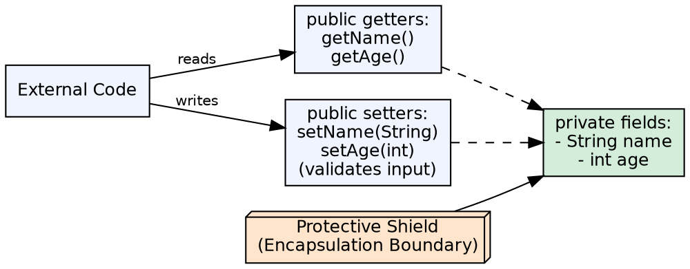
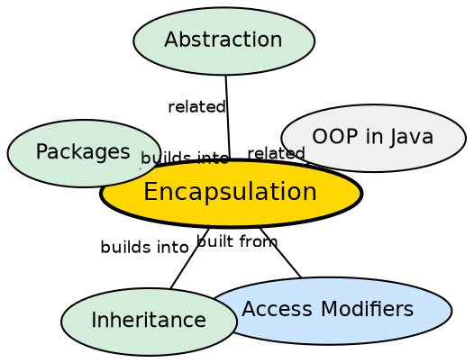

## The Problem

When an object's internal data is directly exposed, any code can modify it to an invalid state — setting a person's age to -5, changing an account balance without authorization, or breaking invariants that other methods depend on. Without encapsulation, debugging becomes impossible because any line of code could be responsible. The class has no control over its own data.

## Core Idea

**Encapsulation** is the process of wrapping data (fields) and the methods that operate on that data into a single unit (class), acting as a **protective shield** that prevents data from being accessed directly from outside the class. Fields are declared `private`, and access is provided through `public` getter and setter methods. This improves data security, maintainability, and provides controlled access.

## How It Works

Fields are marked `private` to prevent external access. Getter methods expose values; setter methods validate and update values before applying changes. This allows the class to maintain invariants — for example, a setAge() method can reject negative values. The internal representation can change without affecting external code because all access goes through the controlled interface.

## Visual Explanation

## Semantic Network

## Key Properties

- **Private fields**: Fields are not directly accessible from outside the class
- **Controlled access**: Getters/setters can include validation, logging, or computed values
- **Decoupling**: Internal implementation can change without breaking clients
- **Maintainability**: Bugs are localized — state changes only happen through known paths
- **Data security**: Acts as a protective shield against unauthorized or invalid modification

## Connections

- **Built from:** [[java-access-modifiers|Access Modifiers]] — private is the key mechanism for data hiding
- **Builds into:** [[java-inheritance|Java Inheritance]] — protected access gives controlled exposure to subclasses
- **Builds into:** [[java-packages|Java Packages]] — package-private access controls visibility within a package
- **Related:** [[java-abstraction|Java Abstraction]] — encapsulation hides data; abstraction hides implementation
- **Related:** [[java-composition|Java Composition]] — encapsulation is essential for safe composition

## Edge Cases & Gotchas

- **Reflection breaks encapsulation**: `Field.setAccessible(true)` allows bypassing private
- **Mutable objects in getters**: Returning a reference to a mutable internal object exposes state — return a defensive copy
- **Anemic domain model**: Too many getters/setters without behavior is not true encapsulation
- **Over-encapsulation**: Making everything private without reason increases code complexity

## Sources

- [[java1-summary|Java Tutorial — Source Summary]] — encapsulation
- [[java2-summary|Java OOP Concepts — Source Summary]] — protective shield metaphor
