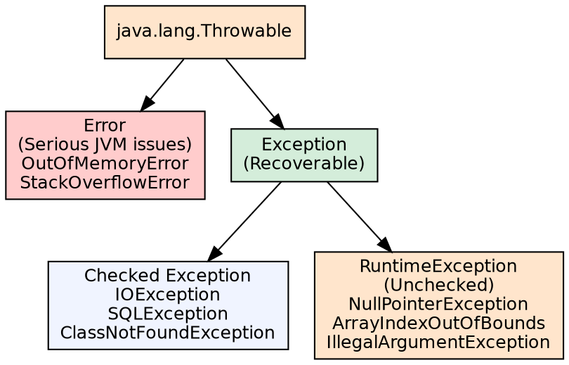
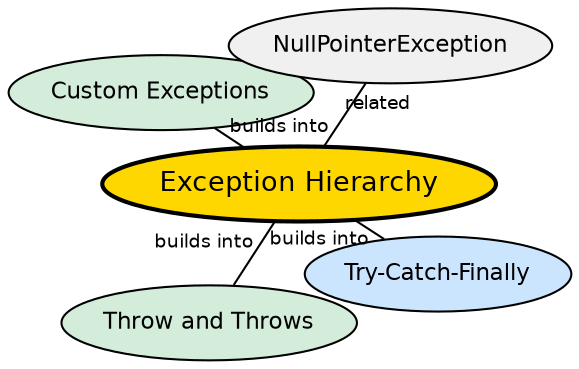

## The Problem

Programs encounter unexpected situations — file not found, network down, invalid input, out of memory. Without a structured error handling mechanism, every method would need to check and propagate error codes manually, cluttering business logic and making error paths inconsistent and incomplete.

## Core Idea

Java's exception hierarchy is rooted in `Throwable`, with two main branches: **Exception** (recoverable conditions) and **Error** (serious JVM problems). Exceptions are further divided into **checked** (must be handled or declared) and **unchecked** (`RuntimeException`, may occur anywhere).

## How It Works

When an exceptional condition occurs, the JVM (or user code) creates an exception object and "throws" it. The runtime searches the call stack for a matching `catch` block. If none is found, the thread terminates. Checked exceptions are enforced at compile time — the compiler verifies they are handled or declared.

## Visual Explanation

## Semantic Network

## Key Properties

- **Throwable root**: Only Throwable subclasses can be thrown and caught
- **Checked exceptions**: Must be caught or declared in the method signature (`throws`)
- **RuntimeException**: Not checked — can be ignored (programmer error: null checks, bounds checks)
- **Error**: Not meant to be caught (JVM in trouble)

## Connections

- **Built from:** [[java-try-catch-finally|Try-Catch-Finally]] — catching exceptions is the handling mechanism
- **Builds into:** [[java-throw-throws|Throw and Throws]] — declaring and propagating exceptions
- **Builds into:** [[java-custom-exceptions|Custom Exceptions]] — user-defined exceptions extend the hierarchy
- **Related:** [[java-object-class|Java Object Class]] — Throwable inherits from Object and overrides toString()

## Edge Cases & Gotchas

- **Checked exception abuse**: Over-declaring checked exceptions couples callers to implementation details
- **Catching Exception**: Catches RuntimeException too — can hide bugs
- **Exception swallowing**: Empty catch blocks silently discard errors
- **Finally vs return**: finally block executes even if try has a return statement