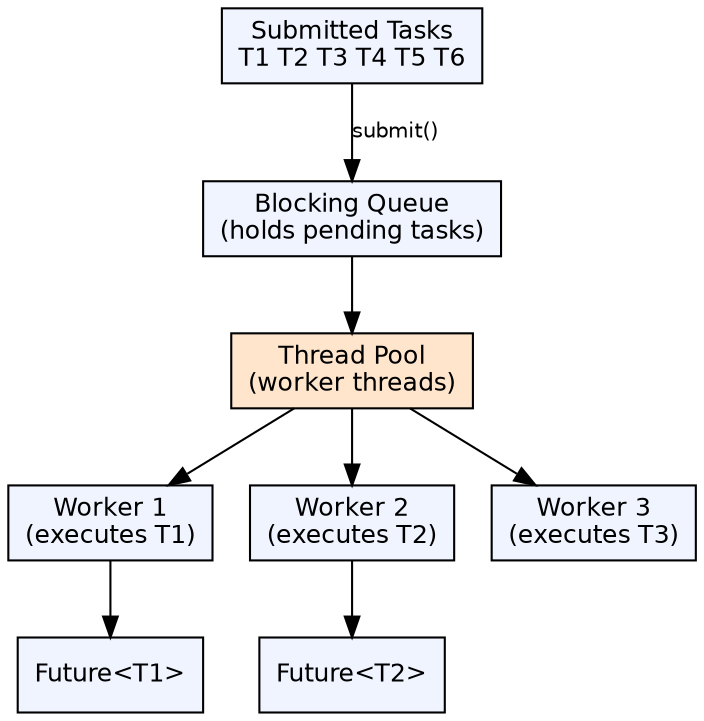
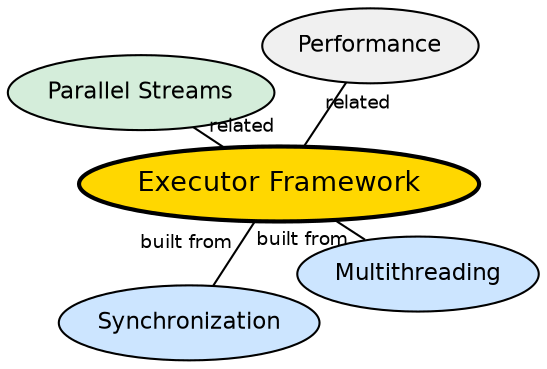

## The Problem

Creating a new thread for every task is expensive and unscalable — thread creation has overhead, too many threads cause contention and memory pressure, and managing thread lifecycles manually is error-prone. A better abstraction is needed for task execution.

## Core Idea

The **Executor framework** decouples task submission from task execution. The core interfaces are `Executor` (single task execution), `ExecutorService` (lifecycle management), and `ScheduledExecutorService` (delayed/periodic tasks). Common implementations include `ThreadPoolExecutor`, `Executors.newFixedThreadPool()`, and `Executors.newCachedThreadPool()`.

## How It Works

Tasks (Runnable or Callable) are submitted to an ExecutorService. The framework maintains a pool of worker threads and a task queue. When a task is submitted, it's either assigned to an available thread or queued. Callable tasks return a `Future` that can be queried for the result once computation completes.

## Visual Explanation

## Semantic Network

## Key Properties

- **Thread reuse**: Worker threads are recycled, avoiding creation overhead
- **Bounded queues**: Prevents unbounded memory growth from pending tasks
- **Rejection policy**: What happens when the queue is full (abort, discard, caller-runs)
- **Lifecycle control**: `shutdown()` (no new tasks) and `shutdownNow()` (force stop)

## Connections

- **Built from:** [[java-multithreading|Java Multithreading]] — the framework manages threads internally
- **Built from:** [[java-synchronization|Java Synchronization]] — internal task queues are synchronized
- **Builds into:** [[java-lambda-and-streams|Streams & Lambdas]] — parallelStream() uses the common ForkJoinPool
- **Related:** [[java-deadlock|Java Deadlock]] — thread pools can deadlock if tasks depend on each other

## Edge Cases & Gotchas

- **Hidden thread leak**: Not shutting down an executor prevents JVM exit
- **Task submission inside tasks**: Tasks submitted from within running tasks can cause thread pool deadlock
- **CachedThreadPool unbounded**: `newCachedThreadPool()` creates threads without bound under load
- **ForkJoinPool work stealing**: Each worker has its own deque — steals from others when idle

## Sources

- [[java1-summary|Java Tutorial — Source Summary]] — executor framework and thread pools
