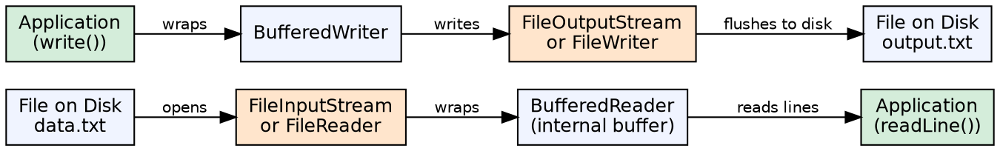
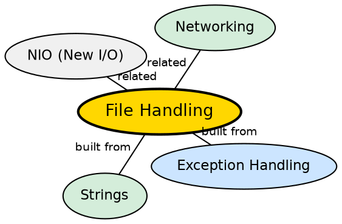

## The Problem

Applications need to read and write data from persistent storage — configuration files, user data, logs, documents. Without a standardized file I/O system, each platform would have different APIs, and developers would need to handle raw bytes, character encoding, and buffering manually.

## Core Idea

Java provides file I/O through the `java.io` package (stream-based) and `java.nio.file` package (channel-based). The I/O model uses **streams** — sequences of data flowing from source to destination. Key classes include `FileInputStream`/`FileOutputStream` (binary), `FileReader`/`FileWriter` (text), `BufferedReader`/`BufferedWriter` (buffered), and the modern `Files`/`Paths` utility classes.

## How It Works

A program opens a stream to a file: an input stream reads bytes from the file into memory; an output stream writes bytes to the file. Readers/Writers handle character encoding (converting between bytes and characters). Buffered streams wrap other streams to reduce disk access by reading/writing chunks.

## Visual Explanation

## Semantic Network

## Key Properties

- **Stream types**: Byte streams (`InputStream`/`OutputStream`) and character streams (`Reader`/`Writer`)
- **Buffered I/O**: Wrapping streams in buffers drastically improves performance
- **Try-with-resources**: Auto-closes streams that implement `AutoCloseable`
- **NIO.2** (Java 7+): `Files`, `Paths`, `Path` with symbolic link support, file watching, and metadata access

## Connections

- **Built from:** [[java-try-catch-finally|Try-Catch-Finally]] — file I/O operations always need exception handling
- **Built from:** [[java-strings|Java Strings]] — text I/O reads/writes String data
- **Builds into:** [[java-socket-programming|Java Socket Programming]] — socket I/O uses InputStream/OutputStream patterns
- **Related:** [[java-memory-management|Java Memory Management]] — buffered I/O uses heap memory for buffers

## Edge Cases & Gotchas

- **Encoding issues**: Always specify charset (UTF-8) explicitly — platform default varies
- **File not closed**: Resource leak — always use try-with-resources
- **File.separator**: Use `File.separator` or `Paths.get()` for cross-platform paths
- **Large files**: Reading entire files into memory causes OOM — use streaming