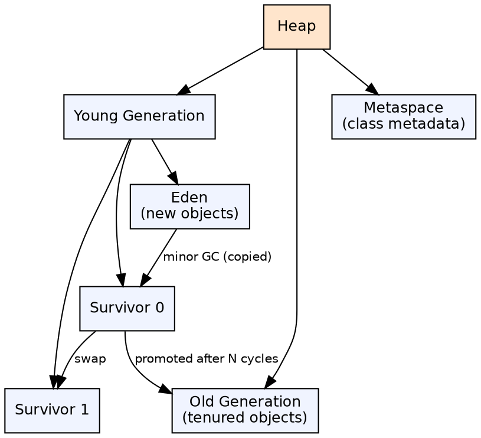
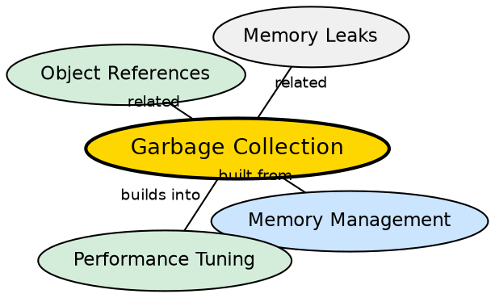

## The Problem

Manual memory management (like C's `malloc`/`free`) is error-prone — forgetting to free causes memory leaks, freeing too early causes dangling pointers, and double-freeing causes crashes. In large applications, tracking object lifetimes manually is nearly impossible.

## Core Idea

**Garbage Collection (GC)** automatically reclaims memory occupied by objects that are no longer reachable. The JVM identifies unused objects, reclaims their memory, and compacts the heap to prevent fragmentation. Developers are freed from manual memory management, at the cost of occasional GC pauses.

## How It Works

The heap is divided into generations: **Young** (Eden + Survivor spaces) and **Old** (Tenured). New objects are allocated in Eden. Minor GC collects the young generation — live objects are copied to Survivor, then eventually promoted to Old. Major GC collects the entire heap. Different collectors (Serial, Parallel, G1, ZGC) use different algorithms (mark-sweep, mark-compact, concurrent).

## Visual Explanation

## Semantic Network

## Key Properties

- **Generational hypothesis**: Most objects die young — optimizing for this yields performance
- **GC pause**: "Stop-the-world" events freeze application threads (duration varies by collector)
- **Concurrent collectors**: ZGC, Shenandoah, G1 aim for sub-millisecond pause times
- **GC tuning**: JVM flags control heap sizes, collector selection, and GC behavior

## Connections

- **Built from:** [[java-memory-management|Java Memory Management]] — GC manages the heap portion of JVM memory
- **Builds into:** [[java-memory-management|Java Memory Management]] — GC tuning is critical for application throughput
- **Related:** [[java-multithreading|Java Multithreading]] — GC pauses affect all threads (stop-the-world)
- **Related:** [[java-object-class|Java Object Class]] — finalize() is called by GC before reclaiming (deprecated)

## Edge Cases & Gotchas

- **System.gc()**: Suggests GC but does not guarantee it runs — ignore this call in production
- **Finalization**: `finalize()` is deprecated (Java 9+) — use Cleaner or try-with-resources
- **GC logs**: Enable with `-Xlog:gc*` for tuning — critical for diagnosing memory issues
- **Object resurrection**: In finalize(), an object can make itself reachable again (avoid this pattern)

## Sources

- [[java1-summary|Java Tutorial — Source Summary]] — garbage collection
