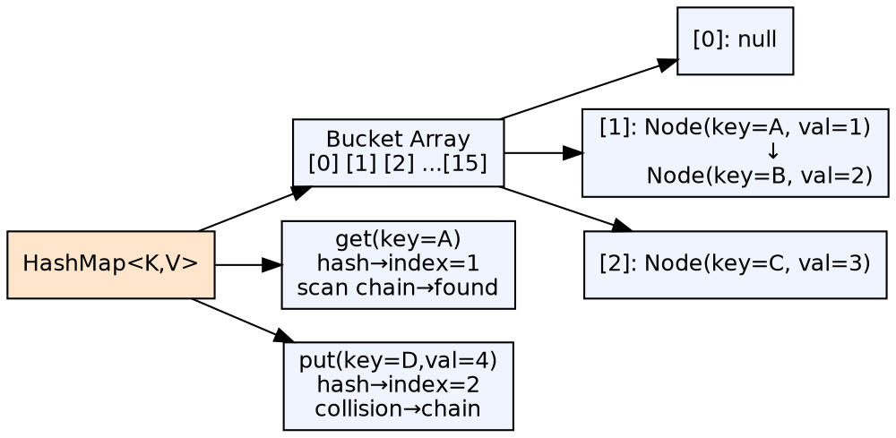
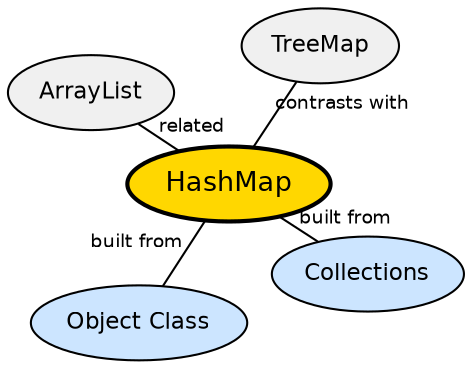

## The Problem

Storing and looking up data by a key (not an index) is a fundamental need — finding a user by ID, looking up a configuration value by name, caching computed results. Without a hash-based map, these lookups would require scanning a list, which is O(n) and scales poorly.

## Core Idea

**HashMap** implements the `Map` interface using a hash table. It stores key-value pairs, computes a hash code of the key to determine an index, and provides O(1) average-time performance for put, get, and remove operations. Keys must have properly implemented `hashCode()` and `equals()`.

## How It Works

The internal structure is an array of "buckets" (nodes). When `put(key, value)` is called, `key.hashCode()` is computed and transformed into a bucket index. If the bucket is empty, a new node is placed. If occupied, `equals()` is used to check for key equality — if the same key exists, the value is replaced; otherwise, a collision is resolved by chaining (linked list or tree).

## Visual Explanation

## Semantic Network

## Key Properties

- **O(1) average time**: For get, put, remove with good hash distribution
- **O(n) worst case**: When all keys hash to the same bucket (Java 8+ converts long chains to trees)
- **Load factor**: Default 0.75 — when 75% full, capacity doubles (rehashing)
- **Null keys**: HashMap allows one null key (stored in bucket [0])

## Connections

- **Built from:** [[java-object-class|Java Object Class]] — relies on hashCode() and equals() for correct operation
- **Built from:** [[java-collections-framework|Java Collections Framework]] — implements the Map interface
- **Contrasts with:** [[java-comparable-and-comparator|Comparable & Comparator]] — HashMap uses hash codes; TreeMap uses comparison for ordering
- **Related:** [[java-collections-framework|Collections Framework]] — HashSet is internally backed by a HashMap

## Edge Cases & Gotchas

- **Mutable keys**: Changing fields used in hashCode() after insertion makes the key "lost" in the map
- **Hash collision performance**: Bad hashCode() implementation degrades performance to O(n)
- **Rehashing cost**: When the map resizes, all entries are rehashed — an O(n) operation
- **Not thread-safe**: Use `ConcurrentHashMap` for concurrent access

## Sources

- [[java1-summary|Java Tutorial — Source Summary]] — HashMap
