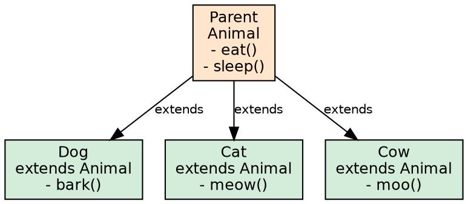
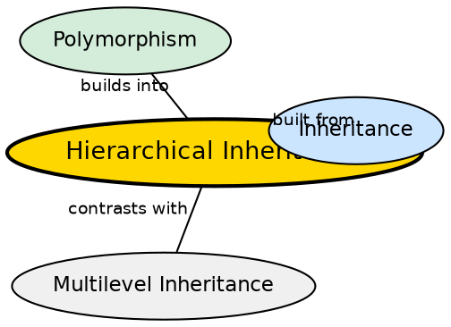

## The Problem

A base class often defines common functionality shared by many specialized types. Animal defines eat() and sleep(), while Dog, Cat, and Cow each add their own sound(). Without hierarchical inheritance, each subclass would reimplement the shared base behavior.

## Core Idea

**Hierarchical Inheritance** occurs when multiple subclasses inherit from a single superclass. One parent serves as the base for many children. This is the most common real-world inheritance pattern — the superclass defines shared behavior and each subclass specializes it.

## How It Works

All subclasses use `extends ParentClass`. Each subclass independently inherits the parent's fields and methods. Changes to the parent propagate to all subclasses automatically. Each subclass can override methods independently without affecting siblings. If `Animal` changes `eat()`, `Dog`, `Cat`, and `Cow` all get the update.

## Visual Explanation

## Semantic Network

## Key Properties

- **One parent, many children**: Single superclass with multiple direct subclasses
- **Independent siblings**: Children do not share a direct relationship with each other
- **Shared behavior propagation**: Parent changes automatically affect all children
- **Most common pattern**: Hierarchical inheritance is the most frequently used inheritance type
- **Polymorphism friendly**: Enables polymorphic substitution — treat any child as the parent type

## Connections

- **Built from:** [[java-inheritance|Java Inheritance]] — the extends mechanism
- **Contrasts with:** [[java-multilevel-inheritance|Multilevel Inheritance]] — fan-out vs chain
- **Contrasts with:** [[java-single-inheritance|Single Inheritance]] — multiple children vs one child from a single parent
- **Related:** [[java-inheritance-types|Inheritance Types]] — hierarchical is one of the five inheritance types
- **Related:** [[java-polymorphism|Java Polymorphism]] — hierarchical inheritance naturally enables polymorphic substitution

## Edge Cases & Gotchas

- **Sibling coupling**: Siblings should not depend on each other's behavior — if they do, the hierarchy is wrong
- **Refactoring difficulty**: Changing the parent interface affects all children simultaneously