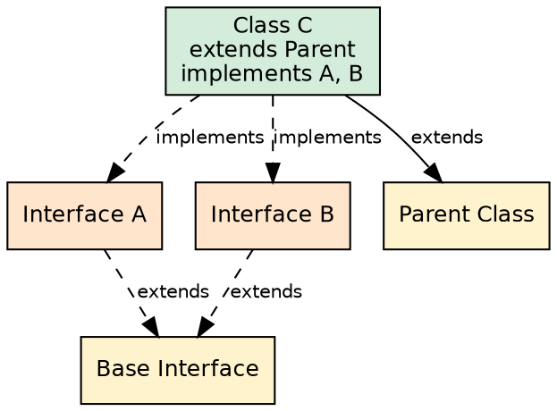
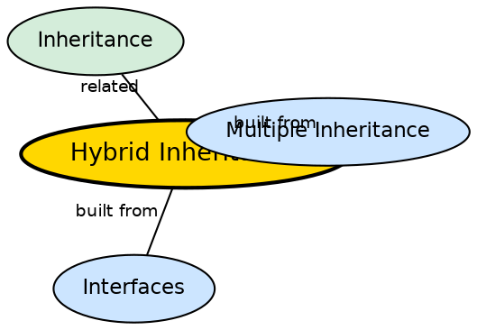

## The Problem

Complex class hierarchies often need to combine multiple inheritance patterns — both hierarchical and multiple inheritance simultaneously. A class might extend a parent class while implementing multiple interfaces, creating a hybrid structure. Without a safe way to do this, complex type hierarchies would be impossible.

## Core Idea

**Hybrid Inheritance** is a combination of two or more types of inheritance. In Java, this is achievable only through interfaces. For example, a class may implement two interfaces that themselves extend a base interface, while the class also extends a parent class. The diamond problem is avoided because interfaces provide no conflicting state resolution — the class always wins over interface defaults.

## How It Works

In hybrid inheritance: `Interface1` and `Interface2` extend `BaseInterface`. A class `C` extends `ParentClass` and implements `Interface1`, `Interface2`. The class inherits behavior from both the class hierarchy (via extends) and the interface hierarchy (via implements). Java's rule is: class implementation always takes priority over interface default methods, preventing ambiguity. The result is a combination of multilevel (via the class chain) and multiple (via interfaces) inheritance.

## Visual Explanation

## Semantic Network

## Key Properties

- **Combination of types**: Merges two or more inheritance types (e.g., multilevel + multiple)
- **Interface-only in Java**: Like multiple inheritance, hybrid is achievable only through interfaces
- **Class-before-interface rule**: Concrete class implementation always beats interface default methods
- **Most complex form**: Overuse leads to unmaintainable class hierarchies
- **No state diamond problem**: Since only interfaces provide the multiple aspect, state conflicts are impossible

## Connections

- **Built from:** [[java-multiple-inheritance|Multiple Inheritance]] — hybrid combines multiple with other types
- **Built from:** [[java-interfaces|Java Interfaces]] — the interface mechanism enables hybrid structures
- **Related:** [[java-inheritance-types|Inheritance Types]] — hybrid is the most complex inheritance type
- **Related:** [[java-inheritance|Java Inheritance]] — every hybrid structure starts with extends

## Edge Cases & Gotchas

- **Complexity**: Hybrid inheritance is the most complex form — overuse leads to unmaintainable hierarchies
- **Method resolution order**: Java uses class-before-interface rule: the concrete class's implementation beats any default method