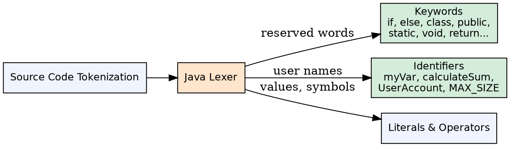
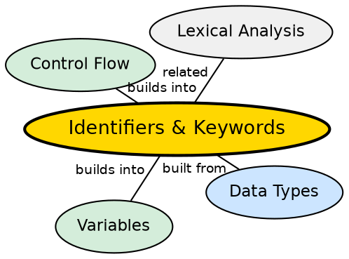

## The Problem

Programming languages need a way to name elements — variables, methods, classes — while reserving certain words for the language's own syntax. Without clear rules for what constitutes a valid name and what words are reserved, developers could write ambiguous or illegal code that confuses both the compiler and other programmers.

## Core Idea

**Identifiers** are names given to program elements (classes, methods, variables). **Keywords** are predefined, reserved words in Java that cannot be used as identifiers. Java has strict naming rules: identifiers must start with a letter, underscore, or dollar sign, and can contain letters, digits, underscores, and dollar signs.

## How It Works

During lexical analysis, the Java compiler tokenizes the source code. It distinguishes between keywords (like `if`, `class`, `public`) which trigger specific parsing rules, and identifiers (like `myVariable`, `calculateTotal`) which refer to user-defined entities. Keywords are always lowercase and have fixed meanings in the language specification.

## Visual Explanation

## Semantic Network

## Key Properties

- **67 keywords** in Java 17 (including `var`, `record`, `sealed`, `yield`)
- **Case-sensitive**: `Class` is an identifier, `class` is a keyword
- **Unicode support**: Identifiers can use Unicode characters (e.g., π, 中国)
- **CamelCase convention**: Classes use PascalCase, variables use camelCase, constants use UPPER_SNAKE_CASE

## Connections

- **Built from:** [[java-data-types|Java Data Types]] — identifiers are typed when declared
- **Builds into:** [[java-variables|Java Variables]] — variables are the primary use of identifiers
- **Builds into:** [[java-methods|Java Methods]] — method names follow identifier rules
- **Contrasts with:** [[java-operators|Java Operators]] — operators are symbols, not keywords/identifiers
- **Related:** [[java-control-flow|Java Control Flow]] — keywords like if, else, switch, case enable branching

## Edge Cases & Gotchas

- **`const` and `goto` are reserved but unused** — you cannot use them as identifiers, but they do nothing
- **`true`, `false`, `null` are literals, not keywords** — but still cannot be used as identifiers
- **`var` is not a keyword** — it is a "reserved type name" with special inference behavior
- **Dollar signs in identifiers** are legal but strongly discouraged (used by compiler-generated code)

## Sources

- [[java1-summary|Java Tutorial — Source Summary]] — identifiers and naming rules
