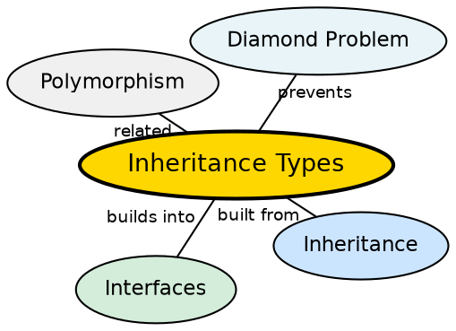

## The Problem

Inheritance in Java is not a single mechanism — there are different ways a class can inherit from another, each serving different design needs. Understanding which type to use is critical: choosing the wrong inheritance structure can lead to deep, fragile hierarchies or the infamous diamond problem.

## Core Idea

Java supports five types of inheritance through a combination of class and interface mechanisms: **single** (one subclass, one superclass), **multilevel** (chain of inheritance), **hierarchical** (multiple subclasses from one superclass), **multiple** (through interfaces — a class implements multiple interfaces), and **hybrid** (combination of types, achievable only through interfaces).

## How It Works

Java strictly forbids multiple inheritance of classes to avoid the diamond problem (ambiguity when two parent classes define the same method). Single, multilevel, and hierarchical inheritance are achieved via the `extends` keyword on classes. Multiple and hybrid inheritance are achieved via `implements` on interfaces. A class can extend at most one class but implement multiple interfaces.

## Visual Explanation

```dot
digraph java_inheritance_types {
  rankdir=TB
  node [shape=box style=filled fillcolor="#f0f4ff" fontname="Helvetica" fontsize=11]
  edge [fontname="Helvetica" fontsize=10]

  Single [label="Single\nA → B" fillcolor="#ffe5cc"]
  MultiLevel [label="Multilevel\nA → B → C" fillcolor="#ffe5cc"]
  Hierarchical [label="Hierarchical\nA → B, A → C" fillcolor="#ffe5cc"]
  Multiple [label="Multiple (Interface)\nI1, I2 → C" fillcolor="#d4edda"]
  Hybrid [label="Hybrid (Interface)\nI1, I2 → B → C" fillcolor="#d4edda"]

  A1 [label="Parent"] -> B1 [label="Child"]
  A2 [label="Grandparent"] -> B2 [label="Parent"] -> C2 [label="Child"]
  A3 [label="Parent"] -> B3 [label="Child1"]
  A3 -> C3 [label="Child2"]
  I1 [label="Interface1"] -> C4 [label="Class" style=dashed]
  I2 [label="Interface2"] -> C4 [style=dashed]
  I3 [label="Interface1"] -> B5 [label="Base" style=dashed]
  I4 [label="Interface2"] -> B5 [style=dashed]
  B5 -> C5 [label="Derived"]

  {rank=same A1 B1}
  {rank=same A2 B2 C2}
  {rank=same A3 B3 C3}
  {rank=same I1 I2 C4}
  {rank=same I3 I4 B5 C5}
}
```

## Semantic Network



## Key Properties

- **Single**: One subclass inherits from one superclass — the simplest form
- **Multilevel**: A chain of inheritance where a class is derived from another derived class
- **Hierarchical**: Multiple subclasses inherit from a single superclass
- **Multiple (interface only)**: A class implements multiple interfaces
- **Hybrid (interface only)**: A combination of inheritance types, achievable only through interfaces

## Connections

- **Built from:** [[java-inheritance|Java Inheritance]] — all inheritance types are specializations of the basic extends mechanism
- **Builds into:** [[java-single-inheritance|Single Inheritance]] — the simplest form, one parent one child
- **Builds into:** [[java-multilevel-inheritance|Multilevel Inheritance]] — chain of derived classes
- **Builds into:** [[java-hierarchical-inheritance|Hierarchical Inheritance]] — one parent, multiple children
- **Builds into:** [[java-multiple-inheritance|Multiple Inheritance]] — through interfaces
- **Builds into:** [[java-hybrid-inheritance|Hybrid Inheritance]] — combination through interfaces
- **Contrasts with:** [[java-interfaces|Java Interfaces]] — interfaces enable multiple and hybrid inheritance

## Edge Cases & Gotchas

- **Diamond problem**: If classes A and B both define the same method, and C extends both, which does C use? Java avoids this by forbidding multiple class inheritance
- **Interface default methods (Java 8+)**: If two interfaces define the same default method, the implementing class must override it to resolve ambiguity
- **Cyclic inheritance**: Java does not allow a class to extend itself, directly or indirectly