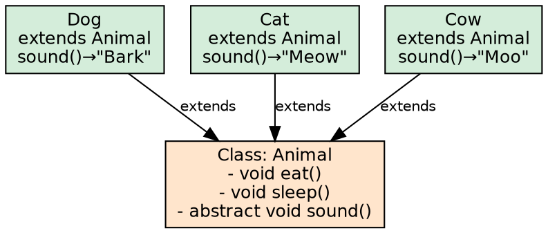
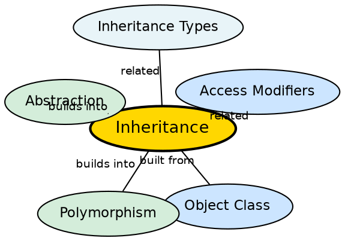

## The Problem

Without inheritance, every class would need to reimplement shared behavior from scratch, leading to massive code duplication. When a base behavior needs to change, every duplicate implementation must be updated individually — a maintenance nightmare in any non-trivial system. For example, without inheritance, Dog, Cat, and Cow would each need their own eat() and sleep() implementations even though they share those behaviors.

## Core Idea

**Inheritance** allows a class (subclass/child) to acquire the fields and methods of another class (superclass/parent). It represents an **"is-a" relationship** — a Dog IS-A Animal, a Car IS-A Vehicle. The subclass uses the `extends` keyword and inherits all accessible members. It can add new members, override methods, and access parent members using `super`. Inheritance promotes code reusability and reduces redundancy.

## How It Works

When a subclass is loaded, its class file contains a reference to its parent class. Method dispatch uses the vtable — each class has a virtual method table that maps method names to actual implementations. `super.method()` bypasses the subclass override and calls the parent's version. Constructor chaining ensures parent initialization happens first. Java supports five types of inheritance, but only through careful restrictions: single, multilevel, hierarchical (via classes), and multiple and hybrid (via interfaces only).

## Visual Explanation

## Semantic Network

## Key Properties

- **Single inheritance**: A class can extend only one parent (no multiple inheritance of classes)
- **Method overriding**: Subclass redefines a method with the same signature
- **super keyword**: Accesses parent members and calls parent constructor
- **final classes/methods**: `final` classes cannot be extended; `final` methods cannot be overridden
- **Code reuse**: Common functionality written once in superclass, reused across subclasses

## Connections

- **Built from:** [[java-object-class|Java Object Class]] — all classes ultimately inherit from Object
- **Builds into:** [[java-polymorphism|Java Polymorphism]] — inheritance enables runtime polymorphism through method overriding
- **Builds into:** [[java-abstraction|Java Abstraction]] — abstract classes depend on inheritance for implementation
- **Contrasts with:** [[java-interfaces|Java Interfaces]] — interfaces provide a contract; classes provide implementation + state
- **Related:** [[java-inheritance-types|Inheritance Types]] — explores the five inheritance variants in Java

## Edge Cases & Gotchas

- **Fragile base class problem**: Changes to parent can break subclasses in unexpected ways
- **Overriding vs hiding**: Static methods are hidden, not overridden — dispatch on reference type, not object type
- **Covariant return types**: Overriding methods can return a subtype of the original return type
- **Constructor order**: Parent constructor runs before child constructor body
- **Multiple inheritance of classes**: Java explicitly forbids this to avoid the diamond problem; use interfaces instead