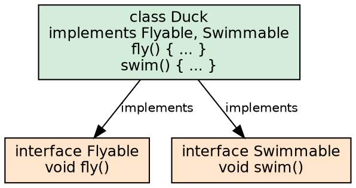
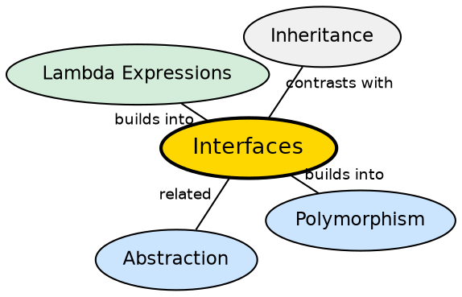

## The Problem

Classes need a way to define behavioral contracts without dictating implementation. Without interfaces, achieving polymorphism across unrelated class hierarchies would require a common abstract superclass — forcing artificial inheritance relationships and preventing multiple type identities.

## Core Idea

An **interface** in Java is a reference type that defines a set of abstract method signatures (a contract) that implementing classes must fulfill. Unlike classes, interfaces support **multiple inheritance** — a class can implement multiple interfaces. Java 8+ added `default` methods (with body) and `static` methods in interfaces.

## How It Works

When a class declares `implements InterfaceName`, the compiler checks that the class provides implementations for all abstract interface methods. At runtime, interface method dispatch uses the `itable` (interface method table), which is resolved differently from the vtable. A class can implement multiple interfaces, each defining a distinct role.

## Visual Explanation

## Semantic Network

## Key Properties

- **Multiple inheritance**: A class can implement many interfaces
- **All methods are public**: Interface methods are implicitly `public abstract`
- **Default methods** (Java 8+): Methods with a body in interfaces, enabling backward-compatible evolution
- **Functional interfaces**: Interfaces with exactly one abstract method — target for lambda expressions

## Connections

- **Built from:** [[java-abstraction|Java Abstraction]] — interfaces are a form of full abstraction
- **Builds into:** [[java-polymorphism|Java Polymorphism]] — interfaces enable polymorphic behavior across unrelated hierarchies
- **Builds into:** [[java-lambda-and-streams|Lambda Expressions & Streams]] — functional interfaces are the target type for lambdas
- **Contrasts with:** [[java-inheritance|Java Inheritance]] — single vs multiple inheritance; interface vs class

## Edge Cases & Gotchas

- **Default method diamond problem**: If two interfaces define the same default method, the class must override
- **Interface constants**: Fields in interfaces are implicitly `public static final`
- **FunctionalInterface annotation**: `@FunctionalInterface` is a documentation aid — the compiler validates single abstract method
- **Sealed interfaces** (Java 17+): Restrict which classes can implement an interface

## Sources

- [[java1-summary|Java Tutorial — Source Summary]] — interfaces
- [[java2-summary|Java OOP Concepts — Source Summary]] — interfaces provide 100% abstraction
