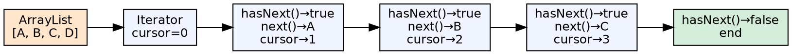
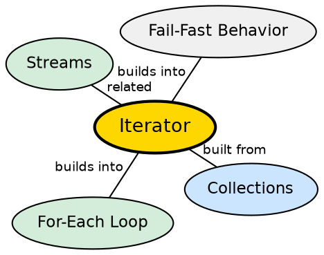

## The Problem

Every collection needs a way to traverse its elements, but different data structures store elements differently — arrays store contiguously, linked lists store with pointers, trees store with child references. A uniform traversal interface is needed that works regardless of internal structure.

## Core Idea

The **Iterator** interface provides a standard way to traverse a collection: `hasNext()` checks for remaining elements, `next()` returns the next element, and `remove()` (optional) removes the last returned element. The `Iterable` interface enables the enhanced for-each loop, which uses an iterator under the hood.

## How It Works

When `iterator()` is called on a collection, a concrete iterator instance is returned. For ArrayList, this is a cursor that walks the backing array. For LinkedList, it follows node pointers. The iterator tracks its position and detects structural modification to the collection (fail-fast behavior).

## Visual Explanation

## Semantic Network

## Key Properties

- **Fail-fast**: Throws ConcurrentModificationException if the collection is modified during iteration
- **for-each sugar**: `for (T item : collection)` compiles to iterator-based loop
- **remove() is safe**: Iterator.remove() modifies the collection without throwing
- **ListIterator**: Extended interface for bidirectional traversal and index access

## Connections

- **Built from:** [[java-collections-framework|Java Collections Framework]] — every Collection provides an iterator()
- **Builds into:** [[java-lambda-and-streams|Streams & Lambdas]] — streams provide an alternative functional iteration model
- **Related:** [[java-loops|Java Loops]] — for-each loop uses iterator behind the scenes
- **Related:** [[java-comparable-and-comparator|Comparable and Comparator]] — used with iterators for sorted traversal

## Edge Cases & Gotchas

- **No reset**: An iterator is single-use — create a new one to traverse again
- **remove() before next()**: IllegalStateException if next() hasn't been called
- **Fail-fast is not guaranteed**: It's a best-effort detection mechanism, not a guarantee
- **LegacyEnumeration**: Older collections (Vector, Hashtable) use Enumeration, not Iterator