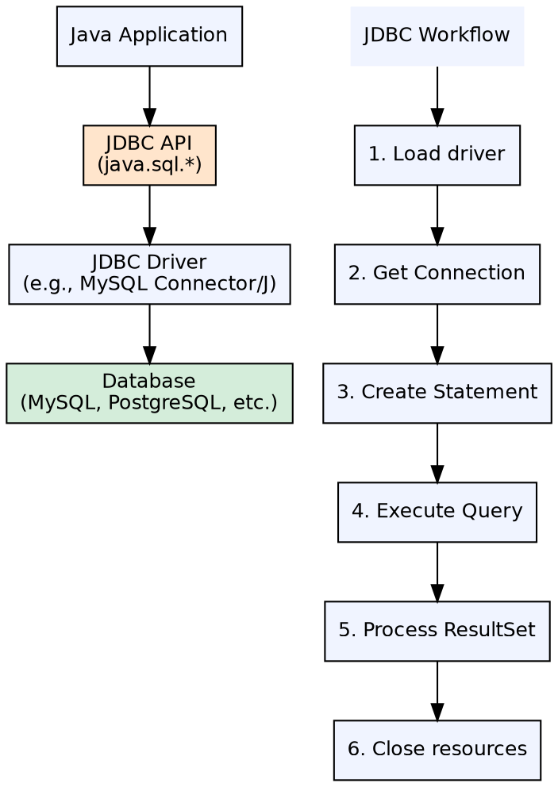
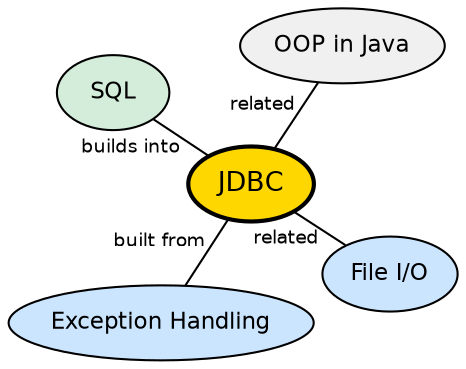

## The Problem

Applications need to store and retrieve data from databases, but each database vendor has its own protocol and API. Without a standard abstraction, switching databases or supporting multiple databases would require rewriting all data access code.

## Core Idea

**Java Database Connectivity (JDBC)** is a standard API that allows Java applications to interact with any relational database through a common interface. Database vendors provide **JDBC drivers** that implement the API. The core workflow is: connect → create statement → execute query → process results → close.

## How It Works

The application loads a JDBC driver (e.g., `com.mysql.cj.jdbc.Driver`), gets a `Connection` via `DriverManager.getConnection()`, creates a `Statement` or `PreparedStatement`, executes SQL, and processes the `ResultSet`. `PreparedStatement` prevents SQL injection by pre-compiling queries with parameter placeholders.

## Visual Explanation

## Semantic Network

## Key Properties

- **Driver types**: Type 1 (JDBC-ODBC bridge), Type 2 (native API), Type 3 (network protocol), Type 4 (pure Java, most common)
- **Statement types**: Statement (static SQL), PreparedStatement (pre-compiled, prevents SQL injection), CallableStatement (stored procedures)
- **CRUD operations**: Create (INSERT), Read (SELECT), Update (UPDATE), Delete (DELETE) via executeQuery() / executeUpdate()
- **Connection pooling**: `DataSource` with connection pooling avoids expensive connection creation per request
- **Transaction management**: `Connection.setAutoCommit(false)` enables manual transaction control with commit() and rollback()

## Connections

- **Built from:** [[java-try-catch-finally|Try-Catch-Finally]] — JDBC resources (Connection, Statement, ResultSet) must be closed in finally blocks
- **Built from:** [[java-exception-hierarchy|Java Exception Hierarchy]] — JDBC methods throw SQLException (checked)
- **Builds into:** [[java-socket-programming|Java Socket Programming]] — JDBC drivers communicate with databases over network sockets
- **Related:** [[java-socket-programming|Java Socket Programming]] — JDBC drivers communicate with databases over network sockets

## Edge Cases & Gotchas

- **Resource leaks**: Never forget to close Connection, Statement, and ResultSet — use try-with-resources
- **SQL injection**: Never concatenate user input into SQL — always use PreparedStatement
- **Connection pool exhaustion**: Long-running transactions or missing close() calls exhaust the pool
- **Driver class loading**: In modern JDBC 4+, drivers auto-register via ServiceLoader (no Class.forName() needed)

## Sources

- [[java1-summary|Java Tutorial — Source Summary]] — JDBC
- [[java3-summary|Advanced Java Tutorial — Source Summary]] — CRUD, statements, transactions
