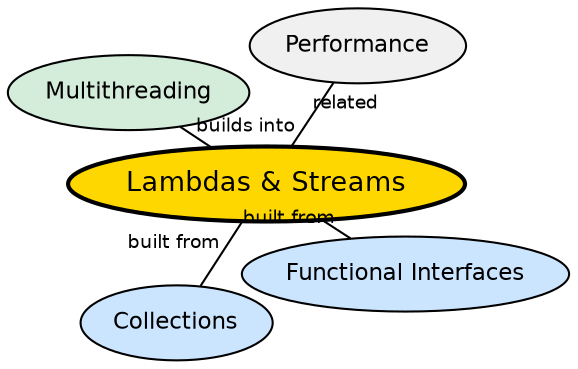

## The Problem

Traditional iteration with loops is imperative and verbose — you tell the computer *how* to iterate (index variables, loop conditions) rather than *what* to compute. This leads to boilerplate code and makes parallel processing difficult. Collections needed a declarative, functional approach.

## Core Idea

**Lambda expressions** provide concise syntax for anonymous functions: `(parameters) -> expression`. **The Stream API** processes collections in a functional pipeline: source → intermediate operations (filter, map, sorted) → terminal operation (collect, forEach, reduce). **Method references** (`Class::method`) provide even shorter syntax for simple lambdas.

## How It Works

A stream represents a sequence of elements supporting sequential and parallel aggregate operations. Streams are lazy — intermediate operations are not executed until a terminal operation is invoked. The pipeline can be parallelized by calling `.parallelStream()` instead of `.stream()`.

## Visual Explanation

```dot
digraph java_streams {
  rankdir=LR
  node [shape=box style=filled fillcolor="#f0f4ff" fontname="Helvetica" fontsize=12]
  edge [fontname="Helvetica" fontsize=10]

  Source [label="Collection\n[1, 2, 3, 4, 5, 6]"]
  Stream [label="Stream Pipeline" fillcolor="#ffe5cc"]
  Filter [label="filter(n → n % 2 == 0)\n[2, 4, 6]"]
  Map [label="map(n → n * n)\n[4, 16, 36]"]
  Collect [label="collect(toList())\n[4, 16, 36]" fillcolor="#d4edda"]

  Source -> Stream
  Stream -> Filter [label="intermediate"]
  Filter -> Map [label="intermediate"]
  Map -> Collect [label="terminal"]
}
```

## Semantic Network

## Key Properties

- **Declarative**: Focus on *what*, not *how* — express intent directly
- **Lazy evaluation**: Intermediate operations execute only when a terminal operation is invoked
- **Parallelism**: `parallelStream()` splits work across multiple threads automatically
- **Immutability**: Streams do not modify the source collection

## Connections

- **Built from:** [[java-interfaces|Java Interfaces]] — lambdas target functional interfaces (Runnable, Comparator, custom)
- **Built from:** [[java-collections-framework|Java Collections Framework]] — streams originate from collections
- **Builds into:** [[java-multithreading|Java Multithreading]] — parallelStream() enables easy parallel processing
- **Contrasts with:** [[java-loops|Java Loops]] — declarative vs imperative iteration

## Edge Cases & Gotchas

- **Stream reuse**: A stream cannot be reused after a terminal operation — create a new one
- **Stateful lambdas**: Avoid mutable state in lambda bodies (not thread-safe)
- **Performance**: Streams have overhead vs loops for simple operations — use for complex pipelines
- **parallelStream() pitfalls**: Shared mutable state in parallel streams causes data races

## Sources

- [[java1-summary|Java Tutorial — Source Summary]] — lambda expressions and streams
