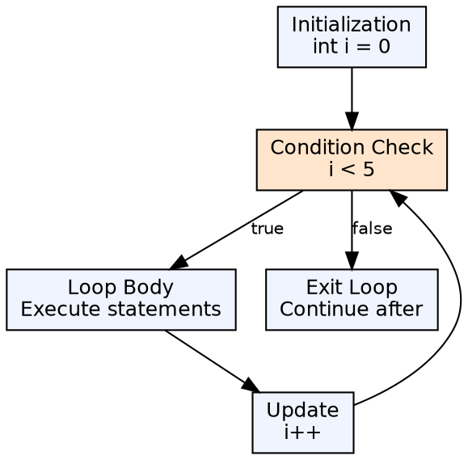
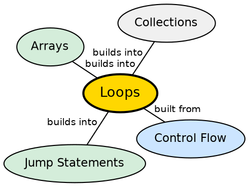

## The Problem

Many programming tasks require executing the same block of code repeatedly — processing each element of an array, reading lines from a file, or retrying an operation until it succeeds. Without loops, every repetition would require manual code duplication, leading to bloated, error-prone programs.

## Core Idea

Java provides three loop constructs: `for` (when the number of iterations is known), `while` (when iteration continues as long as a condition is true), and `do-while` (same as `while` but guarantees at least one execution). The enhanced `for-each` loop simplifies iteration over arrays and collections.

## How It Works

A loop consists of an initialization, a termination condition, an update expression (for `for` loops), and a body. The JVM evaluates the condition before (or after, for `do-while`) each iteration. If true, the body executes; if false, execution jumps past the loop. The `for-each` loop uses an iterator under the hood for collections.

## Visual Explanation

## Semantic Network

## Key Properties

- **For-each syntax**: `for (Type var : iterable)` — cleaner, no index variable
- **While**: Zero or more iterations (condition checked first)
- **Do-while**: One or more iterations (condition checked after first run)
- **Nested loops**: Loops inside loops for multi-dimensional traversal

## Connections

- **Built from:** [[java-control-flow|Java Control Flow]] — loops use boolean conditions like if-statements
- **Built from:** [[java-operators|Java Operators]] — relational and arithmetic operators control iteration
- **Builds into:** [[java-arrays|Java Arrays]] — loops are the primary way to traverse arrays
- **Builds into:** [[java-collections-framework|Java Collections Framework]] — iteration over collections

## Edge Cases & Gotchas

- **Infinite loops**: `while(true)` or `for(;;)` without break conditions
- **Off-by-one errors**: Using `<=` instead of `<` in loop conditions
- **Concurrent modification**: Modifying a collection while iterating with for-each throws `ConcurrentModificationException`
- **Performance**: Enhanced for-each on arrays is identical to index-based loops after compilation