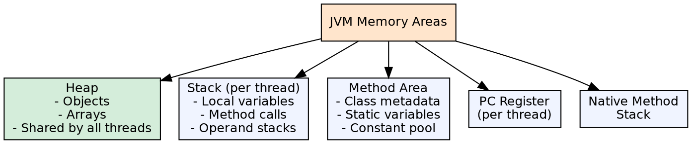
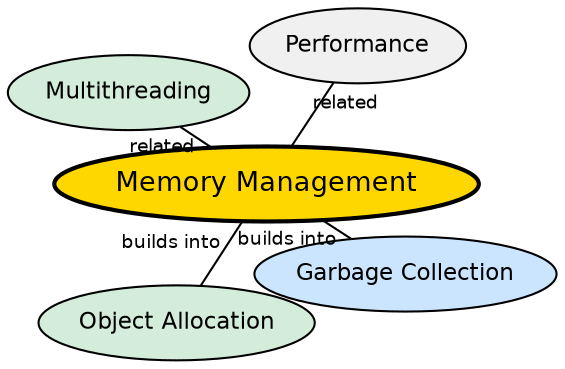

## The Problem

Every running Java program needs memory for code, objects, method calls, and metadata. Without a well-defined memory model, different JVM implementations would allocate and organize memory differently, breaking the platform independence promise and making performance unpredictable.

## Core Idea

The JVM divides memory into several runtime areas: **Heap** (all objects and arrays), **Stack** (each thread has its own stack for method calls and local variables), **Method Area** (class metadata, static variables, constant pool), and native areas (program counter register, native method stacks).

## How It Works

When a method is called, a stack frame is pushed onto the thread's stack containing local variables, operand stack, and frame data. New objects are allocated on the heap (Eden space in young generation). Class structures are stored in the method area (meta space in Java 8+). The JVM's memory manager coordinates allocation and garbage collection.

## Visual Explanation

## Semantic Network

## Key Properties

- **Heap shared**: All threads share the same heap; objects are visible across threads
- **Stack is thread-private**: Each thread has its own stack, isolated from others
- **Automatic management**: The JVM handles allocation and garbage collection — no manual free()
- **Configurable sizes**: Heap and stack sizes are set via JVM flags (-Xmx, -Xms, -Xss)

## Connections

- **Built from:** [[java-platform-independence|Java Platform Independence]] — the JVM's memory model is part of its portable runtime
- **Builds into:** [[java-garbage-collection|Java Garbage Collection]] — GC reclaims heap memory automatically
- **Builds into:** [[java-multithreading|Java Multithreading]] — each thread has its own stack, but shared heap requires synchronization
- **Related:** [[java-wrapper-classes|Java Wrapper Classes]] — wrappers live on the heap; primitives can live on stack

## Edge Cases & Gotchas

- **StackOverflowError**: Infinite recursion or deep call chains exhaust the stack
- **OutOfMemoryError**: Heap is full and GC cannot reclaim enough space
- **Metaspace** (Java 8+): Replaces PermGen — grows dynamically by default, but can still exhaust native memory
- **Memory leak**: Objects held by unintended references prevent GC — common with collections, listeners, caches

## Sources

- [[java1-summary|Java Tutorial — Source Summary]] — memory management
