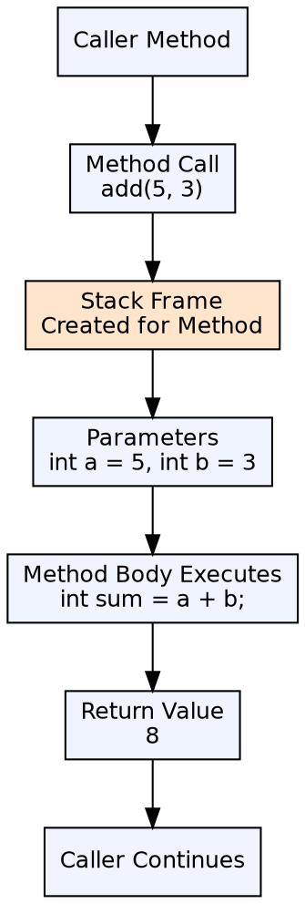
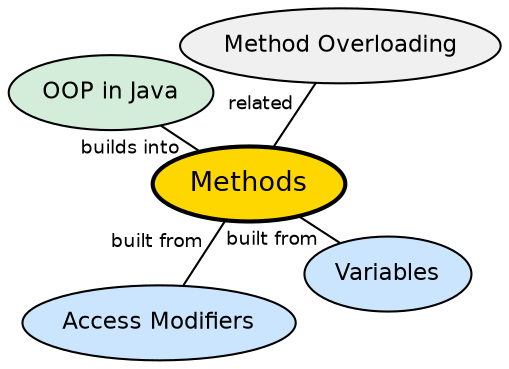

## The Problem

Without reusable code blocks, programs would be long, repetitive, and impossible to maintain at scale. Every operation — from calculating a value to processing input — would need to be written inline wherever it's needed, leading to massive code duplication and scattered logic.

## Core Idea

A **method** in Java is a named block of code that performs a specific task. Methods accept parameters, may return a value, and can be called from other parts of the program. They enable code reuse, modularity, and the DRY (Don't Repeat Yourself) principle. Java supports **method overloading** — multiple methods with the same name but different parameter lists.

## How It Works

When a method is called, the JVM creates a new stack frame with space for parameters and local variables. Arguments are evaluated and assigned to parameters (pass-by-value). The method body executes, and control returns to the caller with (or without) a return value. Overloaded methods are resolved at compile time based on the argument types.

## Visual Explanation

## Semantic Network

## Key Properties

- **Method signature**: Method name + parameter types (not return type)
- **Overloading**: Same name, different parameters (compile-time polymorphism)
- **Pass-by-value**: All arguments are copied; primitives are safe, object references point to same object
- **Return type**: `void` for no return, or any valid type; must use `return` with a matching value

## Connections

- **Built from:** [[java-variables|Java Variables]] — methods use local variables and parameters
- **Built from:** [[java-access-modifiers|Access Modifiers]] — methods have visibility controls
- **Builds into:** [[java-constructors|Java Constructors]] — constructors are special methods that initialize objects
- **Builds into:** [[java-polymorphism|Java Polymorphism]] — method overriding is runtime polymorphism

## Edge Cases & Gotchas

- **Pass-by-value confusion**: Object references are passed by value — you can modify the object's state but not reassign the reference
- **Varargs overloading**: Calling `method(null)` with a varargs parameter is ambiguous
- **Return after finally**: A `return` in `finally` overrides any previous return
- **Recursive depth**: Deep recursion causes `StackOverflowError`