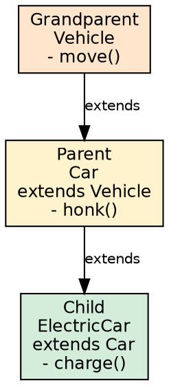
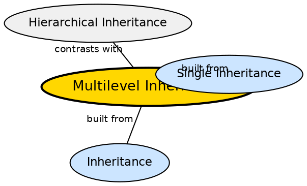

## The Problem

Sometimes functionality needs to be layered across multiple levels of abstraction. A Vehicle defines basic movement, a Car adds four-wheel behavior, and an ElectricCar adds battery management. Each level builds on the previous one. Without multilevel inheritance, each new level would need to duplicate features from all ancestors.

## Core Idea

**Multilevel Inheritance** occurs when a class is derived from another derived class, forming a chain. For example: `Grandparent → Parent → Child`. Each class in the chain inherits from its immediate predecessor and transitively inherits from all ancestors. This creates a layered hierarchy where each level adds specialized behavior.

## How It Works

Each link in the chain uses the standard `extends` keyword. When `Child` is instantiated, constructors fire in order: `Grandparent()` → `Parent()` → `Child()`. Method resolution walks up the chain: if `Child` doesn't override a method, the JVM checks `Parent`, then `Grandparent`. The chain can be arbitrarily deep, but deep hierarchies are fragile and should be avoided.

## Visual Explanation

## Semantic Network

## Key Properties

- **Layered abstraction**: Each level adds specialized behavior on top of the previous
- **Constructor chain**: Constructors fire from topmost ancestor to most derived
- **Transitive inheritance**: Child inherits from ALL ancestors, not just the immediate parent
- **Method resolution walks up**: JVM checks child, then parent, then grandparent, etc.
- **Deep hierarchy is a smell**: 3+ levels often indicates over-engineering; favor composition

## Connections

- **Built from:** [[java-single-inheritance|Single Inheritance]] — each link is a single inheritance relationship
- **Built from:** [[java-inheritance|Java Inheritance]] — extends mechanism drives the chain
- **Contrasts with:** [[java-hierarchical-inheritance|Hierarchical Inheritance]] — chain vs fan-out
- **Related:** [[java-inheritance-types|Inheritance Types]] — multilevel is one of the five inheritance types

## Edge Cases & Gotchas

- **Deep hierarchy**: 3+ levels of inheritance is often a design smell — favor composition over deep inheritance
- **Fragile base class problem**: Changes at the top of the chain can break classes multiple levels down

## Sources

- [[java2-summary|Java OOP Concepts — Source Summary]] — multilevel inheritance
