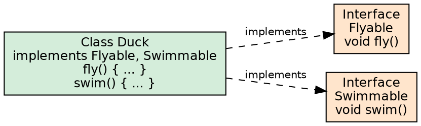
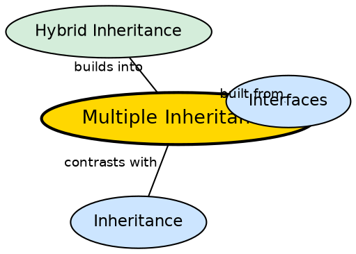

## The Problem

Some classes need to fulfill multiple contracts simultaneously — a class might need to be both `Comparable` (for sorting) and `Runnable` (for threading). Single class inheritance would force a choice between the two, or require a deep hierarchy to combine them.

## Core Idea

**Multiple Inheritance** in Java is the ability of a class to inherit from multiple types. Java supports this **only through interfaces**, not classes. A class can `implement` multiple interfaces, thereby inheriting method contracts from all of them. This avoids the diamond problem because interfaces provide no state (pre-Java 8) and default methods have resolution rules.

## How It Works

A class declares `class C implements I1, I2`. The class must provide implementations for all abstract methods from both interfaces. If two interfaces define default methods with the same signature, the class must override the method to resolve ambiguity. The class IS-A `I1` and IS-A `I2` simultaneously, enabling polymorphic assignment to either interface type. Interface method dispatch uses the `itable` (interface method table), resolved differently from class vtables.

## Visual Explanation

## Semantic Network

## Key Properties

- **Interface-only in Java**: Java does not support multiple inheritance of classes — only interfaces
- **Multiple contracts**: A class can implement any number of interfaces
- **Diamond problem avoided**: Since interfaces have no state (pre-Java 8), there is no state ambiguity
- **Default method rules**: If two interfaces define the same default method, the class must override
- **IS-A multiple types**: A class implementing I1 and I2 is both an I1 and an I2

## Connections

- **Built from:** [[java-interfaces|Java Interfaces]] — interfaces enable multiple type inheritance
- **Built from:** [[java-inheritance-types|Inheritance Types]] — multiple inheritance through interfaces
- **Contrasts with:** [[java-inheritance|Java Inheritance]] — class inheritance is single; interface inheritance is multiple
- **Builds into:** [[java-hybrid-inheritance|Hybrid Inheritance]] — multiple is a building block for hybrid

## Edge Cases & Gotchas

- **Default method conflict**: If two interfaces define the same default method, the class must override it
- **Static methods in interfaces**: Interface static methods are not inherited, avoiding ambiguity

## Sources

- [[java2-summary|Java OOP Concepts — Source Summary]] — multiple inheritance through interface
