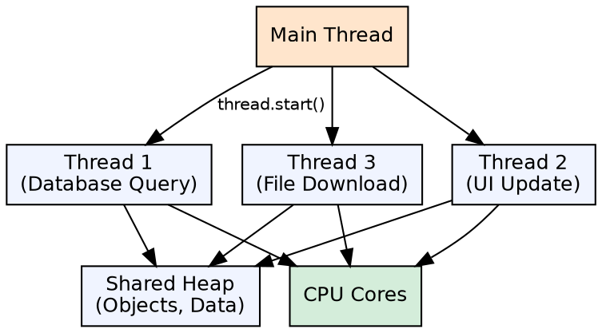
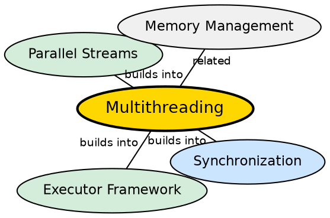

## The Problem

Modern CPUs have multiple cores, but traditional single-threaded programs use only one. Without concurrent execution, applications cannot utilize available hardware, respond to user input while processing data, or handle multiple network connections simultaneously.

## Core Idea

**Multithreading** allows concurrent execution of two or more threads within the same program. Each thread has its own stack and program counter but shares the heap. Java provides two ways to create threads: extending the `Thread` class or implementing the `Runnable` interface. Java also provides `Callable`, `Future`, and the Executor framework for advanced concurrency.

## How It Works

When a Java program starts, the JVM creates the main thread. Additional threads can be created and started. The operating system's thread scheduler allocates CPU time to threads (preemptive multitasking). Threads can be in various states: NEW, RUNNABLE, BLOCKED, WAITING, TIMED_WAITING, TERMINATED.

## Visual Explanation

## Semantic Network

## Key Properties

- **Thread creation**: Extend `Thread` (override run()) or implement `Runnable` (pass to Thread)
- **Daemon threads**: Low-priority background threads that don't prevent JVM exit
- **Thread priority**: 1 (MIN_PRIORITY) to 10 (MAX_PRIORITY) — hints to the scheduler
- **Thread.sleep()**: Pauses the current thread without releasing locks

## Connections

- **Built from:** [[java-synchronization|Java Synchronization]] — threads sharing data need coordination
- **Builds into:** [[java-executor-framework|Java Executor Framework]] — thread pools manage thread lifecycle
- **Builds into:** [[java-deadlock|Java Deadlock]] — incorrect synchronization can cause deadlock
- **Related:** [[java-lambda-and-streams|Streams & Lambdas]] — parallelStream() uses the common ForkJoinPool

## Edge Cases & Gotchas

- **Thread.start() vs run()**: `start()` creates a new thread; `run()` executes in the current thread
- **Race conditions**: Multiple threads reading/writing shared data without synchronization
- **Visibility issues**: Changes by one thread may not be visible to others without happens-before guarantees
- **Daemon threads terminated abruptly**: Daemon threads are killed when no user threads remain