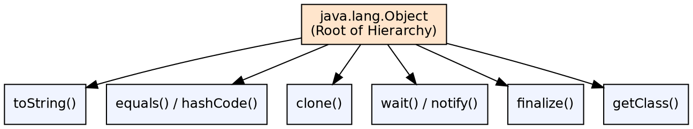
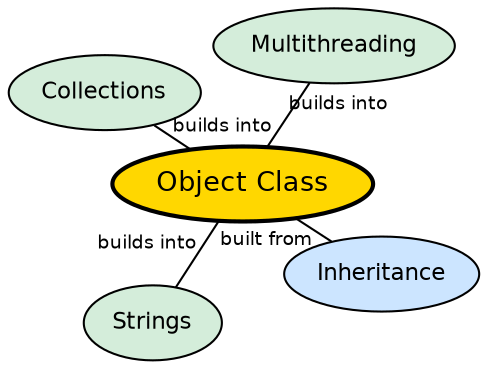

## The Problem

Every object in Java needs a basic set of operations — comparing with other objects, generating a hash code, producing a string representation, and being cloneable. Without a common base class, each class would redefine these fundamental behaviors inconsistently.

## Core Idea

`java.lang.Object` is the root of the Java class hierarchy. Every class implicitly extends `Object`. It provides a set of core methods that all objects inherit: `equals()`, `hashCode()`, `toString()`, `clone()`, `finalize()`, `getClass()`, `notify()`, `wait()`, and `notifyAll()`.

## How It Works

When a class is defined without an explicit `extends` clause, the compiler adds `extends Object`. All inherited methods can be overridden. The default `equals()` uses reference equality (`==`); `hashCode()` returns the memory address (typically); `toString()` returns `ClassName@hashCode`.

## Visual Explanation

## Semantic Network

## Key Properties

- **equals/hashCode contract**: If two objects are equal, they must have the same hash code
- **Thread methods**: `wait()` and `notify()` are defined here, making every object a monitor
- **getClass()**: Returns the runtime class — final, cannot be overridden
- **finalize()**: Called by GC before reclaiming memory (deprecated in Java 9+)

## Connections

- **Built from:** [[java-inheritance|Java Inheritance]] — Object is the ultimate parent of all classes
- **Builds into:** [[java-strings|Java Strings]] — String overrides equals() and hashCode() for value comparison
- **Builds into:** [[java-collections-framework|Java Collections Framework]] — hashCode() is used by HashMap, HashSet
- **Related:** [[java-polymorphism|Java Polymorphism]] — Object reference can hold any type (polymorphism)

## Edge Cases & Gotchas

- **equals() without hashCode()**: Breaking the contract causes HashMap/HashSet to malfunction
- **clone() is tricky**: It performs a shallow copy; overriding requires implementing `Cloneable`
- **finalize() is unreliable**: Not guaranteed to run; use try-with-resources or Cleaner instead
- **toString() default**: `ClassName@1a2b3c4d` is usually not human-readable

## Sources

- [[java1-summary|Java Tutorial — Source Summary]] — Object class
