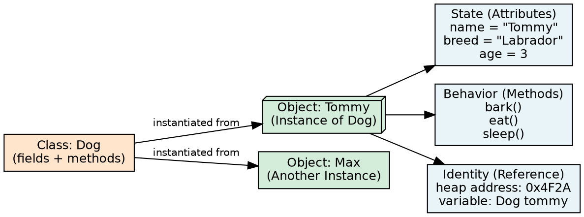
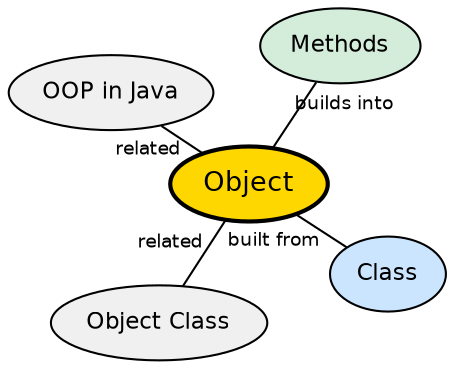

## The Problem

A class is just a blueprint — it defines what an entity looks like but has no concrete existence. To actually execute behavior and hold data, the program needs live instances that exist at runtime, each with its own unique state. Without objects, the program would be a collection of static methods with no persistent data.

## Core Idea

An **object** is a basic unit of Object-Oriented Programming that represents real-life entities. It is a runtime instance of a class. An object mainly consists of three things: **state** (attributes/fields representing properties), **behavior** (methods defining what the object can do), and **identity** (a unique name or reference that enables interaction with other objects).

## How It Works

When `new ClassName()` executes, the JVM allocates memory on the heap for the object's fields (with default values), then calls the constructor to initialize them. A reference to this memory location is returned as the object's identity. Multiple reference variables can point to the same object. Objects interact by invoking methods on each other's references — this is how a Java program performs its work.

## Visual Explanation

## Semantic Network

## Key Properties

- **State**: The fields/attributes that hold the object's data (what it knows)
- **Behavior**: The methods that operate on the object's data (what it does)
- **Identity**: The unique reference that distinguishes this object from others
- **Heap allocation**: All objects live on the heap, managed by the garbage collector
- **Reference semantics**: Variables hold references (pointers) to objects, not the objects themselves

## Connections

- **Built from:** [[java-class|Java Class]] — objects are runtime instances of a class blueprint
- **Builds into:** [[java-methods|Java Methods]] — objects interact by invoking methods on each other
- **Related:** [[java-object-class|Java Object Class]] — every object inherits from java.lang.Object
- **Contrasts with:** [[java-primitive-types|Java Data Types]] — primitives store values directly; objects use reference semantics

## Edge Cases & Gotchas

- **null reference**: An object variable set to null points to no object — calling methods on it throws NullPointerException
- **Object identity vs equality**: `==` compares references (identity); `.equals()` compares content (equality by default uses == unless overridden)
- **Mutable vs immutable objects**: Object state can be mutable (changeable) or immutable (unchangeable after construction)
- **Object lifespan**: Objects become eligible for garbage collection when no reachable references point to them