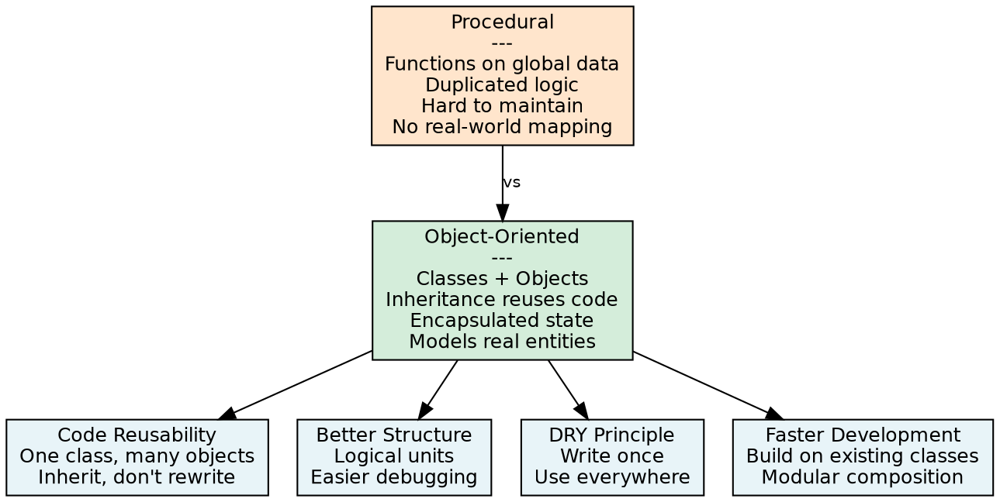
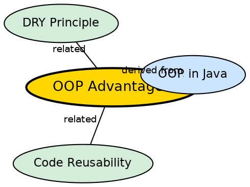

## The Problem

Procedural programming organizes code as a sequence of instructions operating on global data. As programs grow, this approach leads to scattered, interdependent code that is hard to maintain, test, and reuse. A change in one function can break others, and there is no natural way to model real-world entities.

## Core Idea

Object-Oriented Programming offers several key advantages over procedural programming: **code reusability** (classes and objects allow reuse of existing code, reducing duplication), **better structure and maintainability** (programs are organized into logical units), **supports the DRY principle** (common functionality is written once), and **faster development** (modular components enable quicker and scalable application development).

## How It Works

Reusability works through inheritance (subclasses reuse parent code) and composition (objects contain and delegate to other objects). Structure comes from classes grouping related state and behavior into single units. The DRY principle is enforced through class hierarchies — write common code in the base class, specialize in subclasses. Faster development results because well-designed classes become reusable components that can be composed like building blocks.

## Visual Explanation

## Semantic Network

## Key Properties

- **Code reusability**: Inheritance and composition enable reuse across the codebase
- **Better structure**: Logical units (classes) with clear responsibilities
- **DRY principle**: Common functionality centralized in one place
- **Faster development**: Pre-built components accelerate new feature creation
- **Scalability**: Modular design makes it easier to add features without breaking existing code
- **Maintainability**: Changes are localized to specific classes, reducing side effects

## Connections

- **Built from:** [[java-inheritance|Java Inheritance]] — inheritance is the primary mechanism for code reuse
- **Built from:** [[java-composition|Java Composition]] — composition enables flexible reuse without inheritance
- **Contrasts with:** [[java-oop-disadvantages|OOP Disadvantages]] — the tradeoffs of the paradigm
- **Related:** [[java-oop-pillars|The Four OOP Pillars]] — the four pillars enable these advantages

## Edge Cases & Gotchas

- **Over-engineering**: The structure and abstraction that make OOP powerful for large systems add unnecessary complexity to small programs
- **Reuse isn't free**: Inheritance creates coupling between parent and child — changes to parent can break children