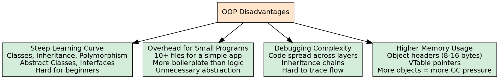
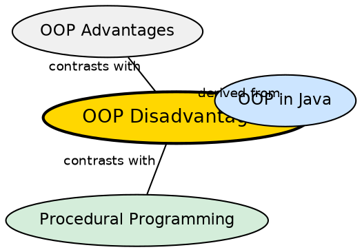

## The Problem

Object-Oriented Programming is not a universal solution — it comes with significant tradeoffs. For small programs, the overhead of class hierarchies, interfaces, and design patterns can far exceed the benefits. Understanding these drawbacks helps developers choose when OOP is appropriate and when simpler paradigms suffice.

## Core Idea

OOP has several disadvantages: **steep learning curve** (concepts like classes, objects, inheritance, and polymorphism can be difficult for beginners), **overhead for small programs** (OOP may require more code and structure than necessary for simple applications), **debugging complexity** (code spread across multiple classes and layers makes debugging more time-consuming), and **higher memory usage** (creating many objects can consume more memory compared to procedural programs).

## How It Works

The learning curve is steep because OOP introduces conceptual overhead — understanding polymorphism requires grasping inheritance, dynamic dispatch, and vtables. Small programs pay a fixed cost: every class needs a separate file, constructors, and accessor methods. Debugging complexity grows because execution flow jumps across classes through method calls and inheritance chains. Memory overhead comes from per-object headers, vtables pointers, and dynamic dispatch structures.

## Visual Explanation

## Semantic Network

## Key Properties

- **Steep learning curve**: Multiple interconnected concepts create a high barrier to entry
- **Overhead for small programs**: Boilerplate and structure exceed logic for simple tasks
- **Debugging complexity**: Scattered state across objects makes tracing bugs harder
- **Higher memory usage**: Per-object metadata overhead adds up at scale
- **Not always appropriate**: Scripting and data-processing tasks often work better procedurally

## Connections

- **Built from:** [[java-inheritance|Java Inheritance]] — deep inheritance hierarchies contribute to debugging complexity
- **Contrasts with:** [[java-oop-advantages|OOP Advantages]] — the same features that help at scale hurt for small programs
- **Related:** [[java-class|Java Class]] — each class adds its own overhead; many classes = more memory
- **Related:** [[java-memory-management|Java Memory Management]] — object allocation and GC pressure are higher in OOP designs

## Edge Cases & Gotchas

- **Not anti-OOP**: These are tradeoffs, not dealbreakers — OOP is usually the right choice for large, evolving systems
- **Premature abstraction**: Creating deep class hierarchies for future needs that never materialize is the biggest source of OOP overhead
- **Performance vs productivity tradeoff**: OOP's memory and CPU overhead is usually dwarfed by developer productivity gains