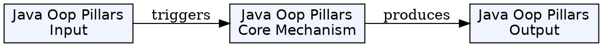
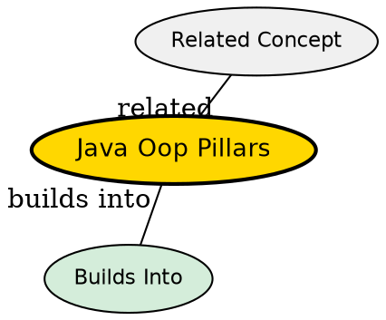

## What's Being Compared

The four fundamental principles of object-oriented programming in Java: encapsulation, inheritance, polymorphism, and abstraction. Each addresses a distinct concern in software design, but together they form a cohesive paradigm.

## The Core Tension

The four pillars balance competing goals: encapsulation hides state (safety), inheritance shares code (reuse), polymorphism enables flexibility (adaptability), and abstraction reduces complexity (clarity). Over-emphasizing any one pillar leads to design problems -- rigid hierarchies from overusing inheritance, or anemic models from over-encapsulation.

## Comparison

| Dimension | [[java-encapsulation|Encapsulation]] | [[java-inheritance|Inheritance]] | [[java-polymorphism|Polymorphism]] | [[java-abstraction|Abstraction]] |
|-----------|-------------|------------|--------------|------------|
| Purpose | Data hiding | Code reuse | Runtime flexibility | Complexity reduction |
| Mechanism | Access modifiers, getters/setters | extends, super | Method overriding, overloading | Abstract classes, interfaces |
| Java keyword | private, protected | extends | @Override, overloaded names | abstract, interface |
| Anti-pattern | Anemic domain model | Deep hierarchy, fragile base class | Type-checking with instanceof | Leaky abstraction |

## The Insight

The four pillars are not independent -- they reinforce each other. Encapsulation protects the internal state that inheritance extends. Polymorphism enables the runtime dispatch that abstraction promises. A well-designed Java class system uses all four in concert: encapsulation hides data, inheritance shares behavior, abstraction defines contracts, and polymorphism enables substitution.

## Visual Explanation

## Semantic Network

## Connections

- [[java-encapsulation|Java Encapsulation]] -- data hiding and access control
- [[java-inheritance|Java Inheritance]] -- code reuse and hierarchy
- [[java-polymorphism|Java Polymorphism]] -- dynamic dispatch and flexibility
- [[java-abstraction|Java Abstraction]] -- complexity management
- [[java-interfaces|Java Interfaces]] -- abstraction through contracts
- [[java-access-modifiers|Access Modifiers]] -- the mechanism for encapsulation