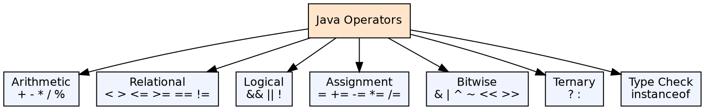
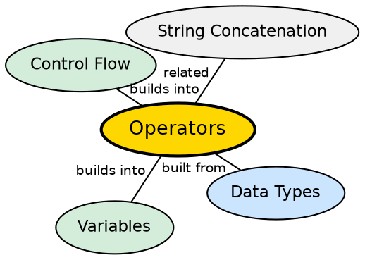

## The Problem

Programs need to perform operations on data — arithmetic calculations, comparisons, logical decisions, and value assignments. Without a well-defined operator system, every operation would require verbose method calls, making code harder to read, write, and maintain.

## Core Idea

Java provides a rich set of **operators** that perform specific operations on one, two, or three operands. These include arithmetic (`+`, `-`, `*`, `/`, `%`), relational (`<`, `>`, `==`, `!=`), logical (`&&`, `||`, `!`), bitwise (`&`, `|`, `^`, `~`, `<<`, `>>`), assignment (`=`, `+=`, `-=`), and ternary (`?:`). Each operator has a fixed precedence and associativity.

## How It Works

The compiler parses expressions according to operator precedence and associativity rules. Operators are syntactic sugar — the compiler translates `a + b` into the appropriate bytecode instructions (like `iadd` for int addition). Short-circuit operators (`&&`, `||`) evaluate the right operand only when needed.

## Visual Explanation

## Semantic Network

## Key Properties

- **Operator precedence**: `*` and `/` before `+` and `-` (standard math precedence)
- **Short-circuit evaluation**: `&&` stops if left is false; `||` stops if left is true
- **Type promotion**: `int + double` promotes to `double` automatically
- **String concatenation**: `+` is overloaded for string concatenation

## Connections

- **Built from:** [[java-data-types|Java Data Types]] — operators behave differently on different types
- **Builds into:** [[java-control-flow|Java Control Flow]] — relational and logical operators drive conditionals
- **Builds into:** [[java-loops|Java Loops]] — comparison operators control loop termination
- **Related:** [[java-variables|Java Variables]] — assignment operators modify variable values

## Edge Cases & Gotchas

- **Integer division truncates**: `5 / 2` = 2 (not 2.5); use `5 / 2.0` for floating-point
- **String + int concatenates**: `"Result: " + 42` = "Result: 42" (not "Result: 0")
- **== compares references for objects**: Use `.equals()` for value comparison
- **Bitwise vs logical**: `&` and `|` do not short-circuit; `&&` and `||` do