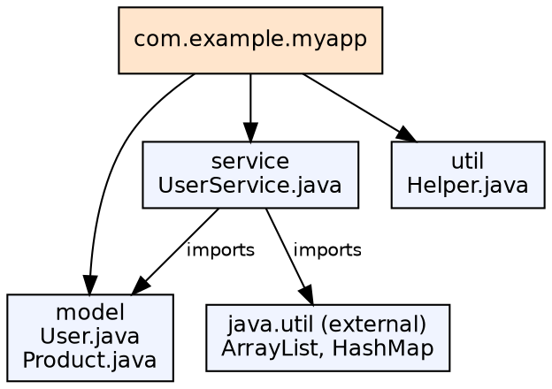
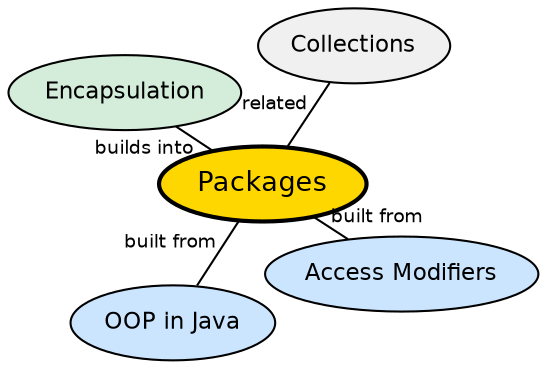

## The Problem

As projects grow, name collisions become inevitable — two developers may independently create a `Customer` class. Without a namespace system, large applications become unmanageable, with naming conflicts and no logical organization of related classes.

## Core Idea

A **package** is a named namespace that organizes related classes and interfaces. The `package` declaration at the top of a file specifies which package the class belongs to. The `import` statement allows referencing classes from other packages without fully qualifying their names.

## How It Works

Packages map to directory structure: `com.example.myapp` corresponds to `com/example/myapp/`. The fully qualified class name (e.g., `java.util.ArrayList`) uniquely identifies every class. The compiler and JVM use the package name to locate `.class` files. Package-private (default) access restricts visibility to classes within the same package.

## Visual Explanation

## Semantic Network

## Key Properties

- **Naming convention**: Reversed domain name (com.example.project), all lowercase
- **Directory structure**: Must match package hierarchy
- **import**: Two forms — explicit (`import java.util.ArrayList`) and wildcard (`import java.util.*`)
- **Static import**: `import static` allows accessing static members without class name

## Connections

- **Built from:** [[java-access-modifiers|Access Modifiers]] — package-private access is tied to package boundaries
- **Builds into:** [[java-encapsulation|Java Encapsulation]] — packages group related classes with controlled visibility
- **Builds into:** [[java-collections-framework|Java Collections Framework]] — the collection classes are organized in `java.util`
- **Related:** [[java-interfaces|Java Interfaces]] — packages organize both classes and interfaces

## Edge Cases & Gotchas

- **Default package**: Classes without a package declaration are in the unnamed (default) package — cannot be imported by classes in named packages
- **Import ordering**: No functional impact — pure style convention
- **Package and module**: Java 9+ modules add another layer of encapsulation above packages
- **Wildcard import does not import subpackages**: `import java.*` does not import `java.util.*`