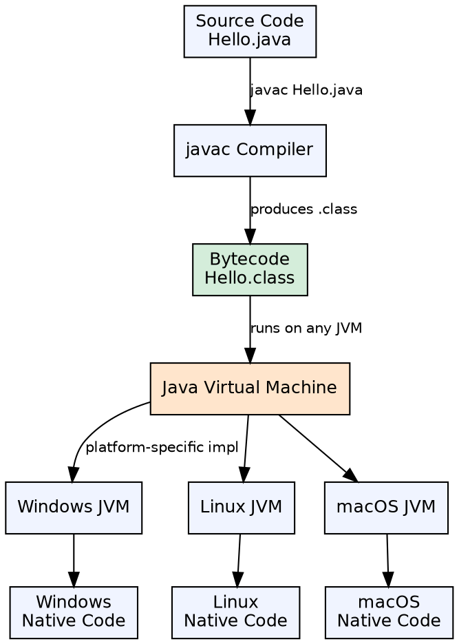
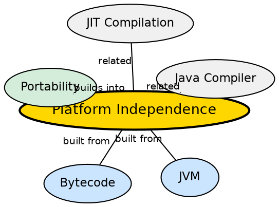

## The Problem

Traditional compiled languages like C and C++ produce machine code specific to a particular CPU architecture and operating system. Developers had to recompile and redistribute their software for every target platform — Windows, Linux, macOS, each with different binaries. This created distribution nightmares, increased maintenance costs, and made cross-platform deployment error-prone.

## Core Idea

Java achieves platform independence by compiling source code into an intermediate representation called **bytecode**, which runs on the **Java Virtual Machine (JVM)** — a software-based execution environment that abstracts away the underlying hardware and OS. Any device with a JVM implementation can run the same Java bytecode without recompilation.

## How It Works

The Java compiler (javac) translates `.java` source files into `.class` files containing bytecode. At runtime, the JVM loads these class files, verifies the bytecode for safety, and either interprets it or compiles it to native machine code using a Just-In-Time (JIT) compiler. Each platform has its own JVM implementation, but all JVMs understand the same bytecode format.

## Visual Explanation

## Semantic Network

## Key Properties

- **Same bytecode, any JVM**: The `.class` file is identical across platforms
- **JIT compilation**: Hot methods are compiled to native code at runtime for performance
- **Security layer**: Bytecode verifier checks for illegal code before execution
- **Memory overhead**: JVM adds ~20-40 MB baseline memory per process

## Connections

- **Built from:** [[java-memory-management|Java Memory Management]] — the JVM manages stack, heap, and method area memory
- **Built from:** [[java-garbage-collection|Java Garbage Collection]] — JVM automates memory reclamation as part of its runtime services
- **Builds into:** [[java-program-structure|Java Program Structure]] — every Java program compiles to platform-independent bytecode before running
- **Related:** [[java-program-structure|Java Program Structure]] — the compile-and-run workflow depends on platform-independent bytecode

## Edge Cases & Gotchas

- **JVM version mismatch**: Bytecode compiled for Java 17 may not run on Java 8 (must target older versions)
- **Platform-specific code**: Native methods via JNI break platform independence
- **JVM fragmentation**: Different vendors have different performance characteristics
- **Not all JVMs are equal**: Embedded vs server JVMs have different startup and optimization profiles

## Sources

- [[java1-summary|Java Tutorial — Source Summary]] — platform independence and JVM fundamentals
