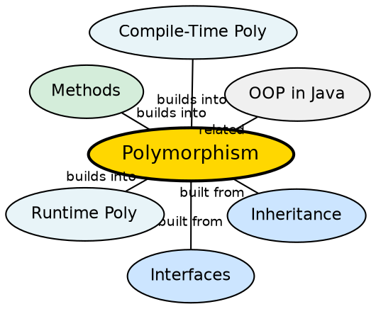

## The Problem

When working with a class hierarchy, code often needs to treat objects of different types uniformly — processing a list of `Shape` objects where each is actually a `Circle` or `Rectangle`. Without polymorphism, every operation would require type checks and casts, making code rigid and unextensible. The same method name (like `speak()`) should produce different behavior depending on the object (Dog barks, Cat meows, Cow moos) without the caller knowing the specific type.

## Core Idea

**Polymorphism** means "many forms" — a single entity can behave differently in different situations. Java supports two types: **compile-time polymorphism** (method overloading — same method name, different parameters, resolved at compile time) and **runtime polymorphism** (method overriding — subclass provides specific implementation of a method already defined in its superclass, resolved at runtime based on the actual object type).

## How It Works

For overloading, the compiler selects the method based on argument types and count at compile time — it's a purely syntactic decision. For overriding, the JVM uses the virtual method table (vtable) stored in the object's class: at runtime, the actual object type determines which method implementation is called, regardless of the reference type. For example, `Animal a = new Dog(); a.speak()` calls Dog's speak() because the vtable points to Dog's implementation.

## Visual Explanation

```dot
digraph java_polymorphism {
  rankdir=TB
  node [shape=box style=filled fillcolor="#f0f4ff" fontname="Helvetica" fontsize=12]
  edge [fontname="Helvetica" fontsize=10]

  Subgraph [label="Types of Polymorphism" fillcolor="#e8f4f8"]

  Overload [label="Compile-Time\n(Overloading)\nsame name, different params\nadd(int a, int b)\nadd(int a, int b, int c)\nResolved: at compilation" fillcolor="#ffe5cc"]
  Override [label="Runtime\n(Overriding)\nsame signature, different impl\nAnimal.speak()→Dog.speak()\nResolved: at runtime via vtable" fillcolor="#ffe5cc"]

  Dog [label="Dog\nspeak() → \"Bark\"" fillcolor="#d4edda"]
  Cat [label="Cat\nspeak() → \"Meow\"" fillcolor="#d4edda"]
  Cow [label="Cow\nspeak() → \"Moo\"" fillcolor="#d4edda"]

  Overload -> Override [style=invis]
  Override -> Dog
  Override -> Cat
  Override -> Cow
}
```

## Semantic Network



## Key Properties

- **Overloading**: Same method name, different parameter lists (compile time)
- **Overriding**: Same signature, different implementation (runtime)
- **@Override annotation**: Compiler-checked indication that a method is overriding a parent method
- **Dynamic dispatch**: The actual object type (not reference type) determines which method runs
- **Single entity, multiple forms**: The same method call can produce different outputs depending on the object

## Connections

- **Built from:** [[java-inheritance|Java Inheritance]] — overriding requires an inheritance relationship
- **Built from:** [[java-interfaces|Java Interfaces]] — interface methods are always dynamically dispatched
- **Builds into:** [[java-lambda-and-streams|Streams & Lambdas]] — functional interfaces enable polymorphic behavior patterns
- **Related:** [[java-methods|Java Methods]] — overloading is a method feature; overriding is an inheritance feature
- **Related:** [[java-compile-time-polymorphism|Compile-Time Polymorphism]] — the overloading mechanism in detail
- **Related:** [[java-runtime-polymorphism|Runtime Polymorphism]] — the overriding mechanism in detail

## Edge Cases & Gotchas

- **Static methods are not polymorphic**: They are hidden, not overridden — dispatch based on compile-time type
- **Private methods are not polymorphic**: They are not inherited and cannot be overridden
- **Overloaded methods with same erasure**: Generics can cause ambiguity after type erasure
- **Covariance**: In Java 5+, overriding methods can return a more specific type
- **Bridge methods**: Compiler generates bridge methods when covariance interacts with generics