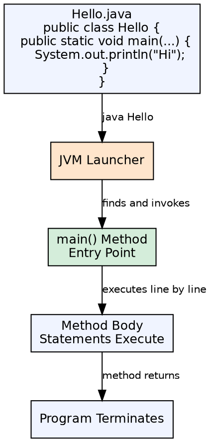
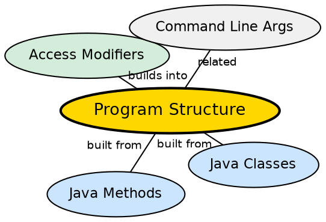

## The Problem

Every programming language needs a well-defined entry point where execution begins. Without a standard structure, developers would need to configure build tools and runtime environments with complex startup instructions, making simple programs unnecessarily difficult to write and run.

## Core Idea

A Java program is organized around classes. The entry point is a special `main` method with a specific signature — `public static void main(String[] args)` — that the JVM calls to start execution. Every executable Java program must have exactly one such method.

## How It Works

The JVM loads the class specified on the command line, looks for the `main` method with the exact signature, and invokes it. The `String[] args` parameter receives command-line arguments. The program executes line by line from the first statement in `main` until the method returns or `System.exit()` is called.

## Visual Explanation

## Semantic Network

## Key Properties

- **Entry point signature**: `public static void main(String[] args)` is the required form
- **Class scope**: Every Java program is a class; no standalone functions
- **Args array**: Command-line arguments arrive as a String array (possibly empty)
- **Exit**: `System.exit(0)` for explicit termination with status codes

## Connections

- **Built from:** [[java-methods|Java Methods]] — the main method follows the same declaration rules
- **Built from:** [[java-access-modifiers|Access Modifiers]] — main must be public for the JVM to access it
- **Builds into:** [[java-methods|Java Methods]] — the main() method follows standard method declaration rules
- **Related:** [[java-platform-independence|Java Platform Independence]] — the compile-once-run-anywhere model that this structure enables

## Edge Cases & Gotchas

- **Missing main()**: `java` command throws `NoClassDefFoundError: no main method`
- **Wrong signature**: Changing any modifier breaks JVM lookup
- **Args can be null in some environments**, though normally an empty array
- **Static context**: main is static — no access to instance fields without creating objects

## Sources

- [[java1-summary|Java Tutorial — Source Summary]] — program structure and main method
