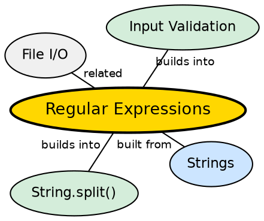

## The Problem

Validating and extracting data from strings is a ubiquitous programming task — checking email format, extracting phone numbers, parsing log files, replacing patterns in text. Doing this with manual character-by-character parsing is tedious, error-prone, and produces brittle code.

## Core Idea

Java provides the `java.util.regex` package for **regular expression** pattern matching. The `Pattern` class compiles a regex string into an optimized finite-state machine. The `Matcher` class applies the pattern to an input string, finding matches, extracting groups, and performing replacements.

## How It Works

A regex string is compiled into a `Pattern` object (immutable, thread-safe). A `Matcher` is created from the pattern and the input string. The matcher scans the input, creating match results. Operations include `find()` (partial match), `matches()` (full match), `group()` (extract captured group), and `replaceAll()`.

## Visual Explanation

```dot
digraph java_regex {
  rankdir=LR
  node [shape=box style=filled fillcolor="#f0f4ff" fontname="Helvetica" fontsize=12]
  edge [fontname="Helvetica" fontsize=10]

  Raw [label='Regex String\n"\\d{3}-\\d{4}"']
  Pattern [label="Pattern.compile()\n→ Compiled FSM" fillcolor="#ffe5cc"]
  Input [label='Input String\n"Call 555-1234 now"']
  Matcher [label="Matcher\nScans input", fillcolor="#d4edda"]
  Match [label="Match Found\nGroup: \"555-1234\""]

  Raw -> Pattern
  Input -> Matcher
  Pattern -> Matcher
  Matcher -> Match
}
```

## Semantic Network



## Key Properties

- **Pattern flags**: `CASE_INSENSITIVE`, `MULTILINE`, `DOTALL`, `UNICODE_CHARACTER_CLASS`
- **Capturing groups**: Parentheses create groups, accessed by index or name
- **Quantifiers**: Greedy (`*`), reluctant (`*?`), possessive (`*+`)
- **Performance**: Compiled patterns are efficient; pre-compile and reuse for repeated matching

## Connections

- **Built from:** [[java-strings|Java Strings]] — regex works on String input and produces String results
- **Builds into:** [[java-strings|Java Strings]] — String.split(), replaceAll(), matches() use regex internally
- **Related:** [[java-file-handling|Java File Handling]] — regex is used for parsing log files and text processing
- **Related:** [[java-collections-framework|Java Collections Framework]] — pattern matching on collection elements

## Edge Cases & Gotchas

- **Catastrophic backtracking**: Nested quantifiers on complex inputs can cause exponential time
- **Backslash escaping in strings**: `\d` in regex becomes `"\\d"` in Java string literals
- **Matcher.reset()**: Reuse a matcher on new input without creating a new Pattern
- **matches() vs find()**: `matches()` requires the entire string to match; `find()` looks for a substring