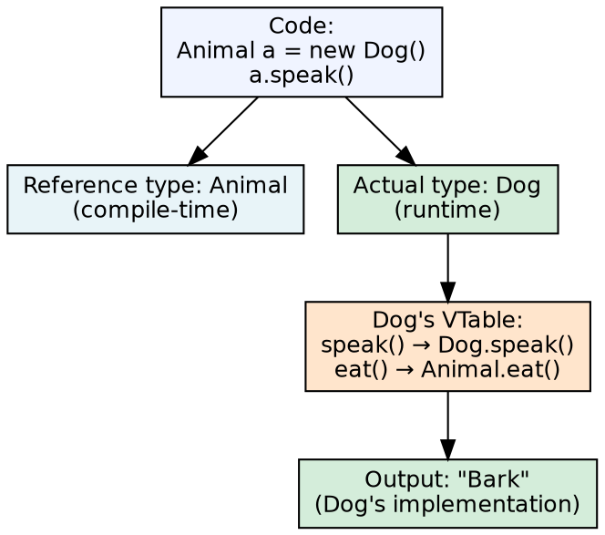
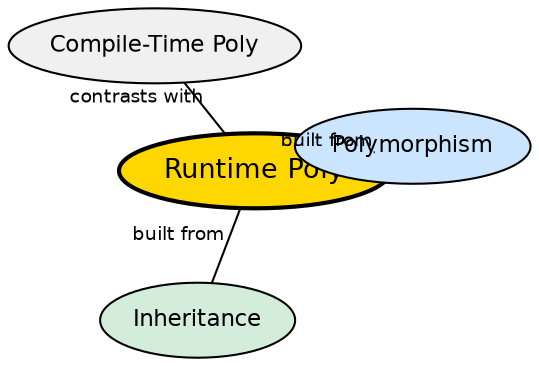

## The Problem

Code written against a general type (e.g., `Animal`) should work correctly when given any specific subtype (Dog, Cat, Cow). Without runtime polymorphism, calling `speak()` on an Animal reference would always execute the Animal version, even though the actual object is a Dog that should Bark. The code would need manual type checks and casts everywhere.

## Core Idea

**Runtime Polymorphism** (also called **Method Overriding**) occurs when a subclass provides a specific implementation of a method already defined in its superclass. The method call is resolved at runtime based on the actual object type, not the reference type. This enables a single method call to produce different behaviors depending on the object — `Animal a = new Dog(); a.speak()` calls `Dog.speak()`, not `Animal.speak()`.

## How It Works

The JVM maintains a **virtual method table** (vtable) for each class. When a method is called on a reference, the JVM looks up the actual object's class vtable, finds the method entry, and dispatches to that implementation. This happens at runtime. For a method to be overridable, it must not be `private`, `static`, or `final`. The `@Override` annotation (optional but recommended) tells the compiler to verify that the method actually overrides a parent method.

## Visual Explanation

## Semantic Network

## Key Properties

- **Same signature**: Overriding method must have same name, return type (or covariant), and parameters
- **Runtime resolution**: Method dispatch happens at runtime via vtable lookup
- **Cannot override**: private, static, and final methods cannot be overridden
- **@Override annotation**: Compiler-verified indicator that a method overrides a parent method
- **Covariant return types**: Java 5+ allows overriding method to return a subtype of the original return type

## Connections

- **Built from:** [[java-inheritance|Java Inheritance]] — overriding requires an inheritance relationship
- **Built from:** [[java-polymorphism|Java Polymorphism]] — runtime polymorphism is one of two polymorphism types
- **Contrasts with:** [[java-compile-time-polymorphism|Compile-Time Polymorphism]] — runtime vs compile-time resolution
- **Related:** [[java-overloading-vs-overriding|Overloading vs Overriding]] — synthesis comparing the two

## Edge Cases & Gotchas

- **Static methods are not polymorphic**: They are hidden, not overridden — call resolves based on reference type
- **Private methods are not polymorphic**: They are not inherited, so they cannot be overridden
- **Constructors cannot be overridden**: Each class has its own constructors; superclass constructors are called via super()
- **Bridge methods**: When covariance interacts with generics, the compiler generates bridge methods to maintain polymorphism