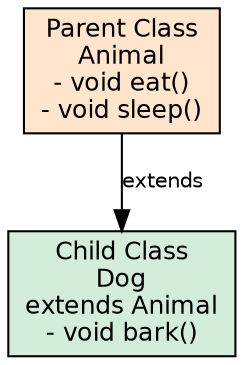
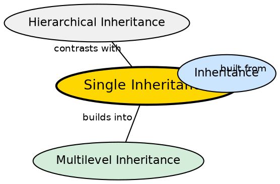

## The Problem

A class often needs to extend the functionality of another class without modifying the original. The simplest form of reuse is one class inheriting from exactly one parent — a direct "is-a" relationship.

## Core Idea

**Single Inheritance** occurs when one subclass inherits from one superclass. It is the simplest and most common form of inheritance. A single chain `Parent → Child` exists where the child gains all accessible members of the parent and can add or override behavior.

## How It Works

The subclass uses `extends ParentClass`. All non-private fields and methods are inherited. The subclass can override methods, add new fields, and access parent members via `super`. Constructor chaining ensures parent construction happens first. The JVM's method dispatch walks up the single inheritance chain, making method resolution straightforward — at most one parent to check.

## Visual Explanation

## Semantic Network

## Key Properties

- **One parent, one child**: Each subclass has exactly one direct superclass
- **Simplest form**: The most basic inheritance relationship in Java
- **extends keyword**: Uses the standard Java extends mechanism
- **Constructor chaining**: Parent constructor runs before child constructor body
- **Predictable resolution**: Method lookup only has one parent to check, no ambiguity
- **implicit Object**: If no extends is specified, the class implicitly extends Object

## Edge Cases & Gotchas

- **No cyclic inheritance**: A class cannot extend itself, directly or indirectly
- **final classes**: A final class cannot be subclassed at all
- **Single chain guarantee**: You always know where a method comes from — only one parent to check, unlike multiple inheritance

## Connections

- **Built from:** [[java-inheritance|Java Inheritance]] — the basic inheritance mechanism
- **Builds into:** [[java-multilevel-inheritance|Multilevel Inheritance]] — single steps can be chained
- **Contrasts with:** [[java-hierarchical-inheritance|Hierarchical Inheritance]] — single vs multiple children from one parent
- **Related:** [[java-inheritance-types|Inheritance Types]] — the broader classification of which single is a part

## Sources

- [[java2-summary|Java OOP Concepts — Source Summary]] — single inheritance
