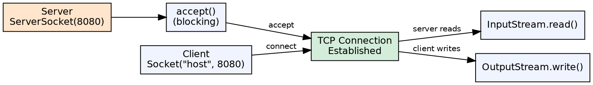
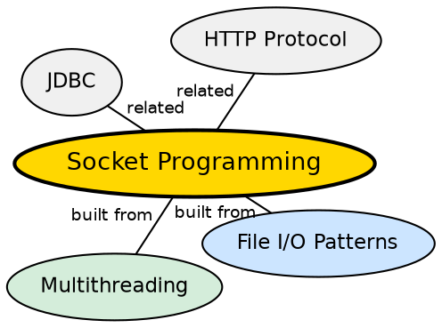

## The Problem

Applications often need to communicate over a network — web browsers talking to servers, chat apps exchanging messages, databases sending query results. Without a standard networking API, every application would need to implement its own network protocol handling at the OS level.

## Core Idea

Java's `java.net` package provides **socket programming** APIs for network communication. `Socket` represents a client endpoint, `ServerSocket` listens for incoming connections. Data is exchanged through `InputStream` and `OutputStream` obtained from the socket, following the same patterns as file I/O.

## How It Works

A server creates a `ServerSocket` bound to a port and calls `accept()` to wait for connections. A client creates a `Socket` with the server's IP and port. TCP establishes a connection via the three-way handshake. Once connected, both sides read from and write to the socket streams.

## Visual Explanation

## Semantic Network

## Key Properties

- **TCP-based**: Reliable, ordered, connection-oriented communication
- **Blocking I/O**: `accept()`, `read()`, and `write()` block until data arrives
- **Multi-threaded servers**: Each connection typically handled by a separate thread
- **URL class**: Higher-level abstraction for HTTP-specific communication

## Connections

- **Built from:** [[java-file-handling|Java File Handling]] — socket I/O uses the same InputStream/OutputStream patterns
- **Built from:** [[java-multithreading|Java Multithreading]] — servers typically handle each client in a separate thread
- **Builds into:** [[java-jdbc|Java JDBC]] — JDBC uses sockets under the hood for database communication
- **Related:** [[java-try-catch-finally|Try-Catch-Finally]] — sockets must be closed cleanly, often in finally blocks

## Edge Cases & Gotchas

- **Socket timeout**: `setSoTimeout()` prevents threads from blocking indefinitely
- **Half-close**: `shutdownOutput()` allows reading after writing is done
- **Thread per connection**: Doesn't scale to thousands of connections — use NIO selectors instead
- **Firewall/NAT**: Socket connections may fail due to firewalls blocking ports