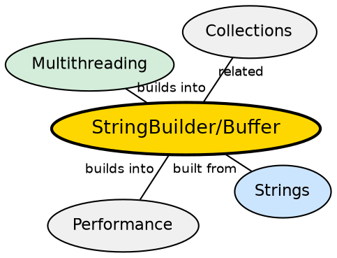

## The Problem

String immutability is great for safety but terrible for performance when building strings dynamically. Each concatenation creates a new String object, copying the entire content. In loops or complex string assembly, this generates O(n²) garbage and CPU overhead.

## Core Idea

**StringBuilder** and **StringBuffer** are mutable sequences of characters. They provide an `append()` method that modifies the internal buffer without creating new objects. StringBuilder is faster (not synchronized) but not thread-safe; StringBuffer is thread-safe (synchronized methods) but slower.

## How It Works

Both classes maintain an internal `char[]` array that grows as needed. When `append()` is called, characters are copied into the buffer at the current position. When the buffer fills up, a new larger array is allocated and the old content is copied. `toString()` creates a (immutable) String from the current buffer contents.

## Visual Explanation

```dot
digraph java_mutable_strings {
  rankdir=TB
  node [shape=box style=filled fillcolor="#f0f4ff" fontname="Helvetica" fontsize=12]
  edge [fontname="Helvetica" fontsize=10]

  SB [label="StringBuilder/StringBuffer" fillcolor="#ffe5cc"]
  Buffer [label="Internal char[] Buffer\n[ H  e  l  l  o     W  o  r  l  d  _  _  _  _ ]\n  ^position=11"]
  Append1 [label='append("Hello")']
  Append2 [label='append(" World")']
  Result [label='toString()\n→ "Hello World"' fillcolor="#d4edda"]

  SB -> Buffer
  Append1 -> Buffer [label="fills first 5 chars"]
  Append2 -> Buffer [label="fills next 6 chars"]
  Buffer -> Result
}
```

## Semantic Network



## Key Properties

- **StringBuffer**: Thread-safe (all public methods are `synchronized`) — use in shared contexts
- **StringBuilder**: Not thread-safe — use in single-threaded contexts (faster)
- **Capacity management**: Default initial capacity is 16; grows by `(oldCapacity * 2) + 2`
- **append() chaining**: Both return `this`, enabling `sb.append("a").append("b")` chaining

## Connections

- **Built from:** [[java-strings|Java Strings]] — both produce immutable Strings via toString()
- **Builds into:** [[java-lambda-and-streams|Streams & Lambdas]] — streams often need StringBuilder for efficient collection
- **Contrasts with:** [[java-strings|Java Strings]] — mutable vs immutable; use cases differ
- **Related:** [[java-synchronization|Java Synchronization]] — StringBuffer's synchronized methods guarantee thread safety

## Edge Cases & Gotchas

- **Capacity waste**: Creating a StringBuilder without an initial size estimate causes repeated resizing
- **StringBuffer overhead**: Synchronization adds ~3-5x overhead; don't use in single-threaded code
- **length vs capacity**: `length()` returns actual content length; internal buffer may be larger
- **Thread safety is per-method only**: Compound operations (check-then-act) still need external synchronization