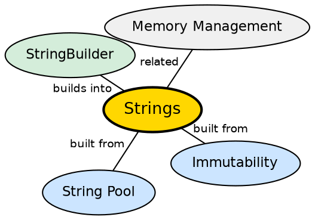

## The Problem

Text processing is fundamental to almost every application — parsing input, generating output, manipulating names, building messages. Many languages make string handling error-prone by treating them as mutable character arrays, leading to buffer overflows, encoding issues, and unintended shared state.

## Core Idea

A **String** in Java is an immutable sequence of characters. Once created, a String's value cannot change — any operation that appears to modify a String (like concatenation or replacement) actually creates a new String object. Strings are stored in a special **String Pool** for efficient memory reuse.

## How It Works

String literals are interned: the JVM maintains a pool of unique String objects. When a literal appears, the JVM checks the pool — if the same string exists, it reuses the reference. The `+` operator for concatenation is compiled to `StringBuilder.append()` calls. Because Strings are immutable, they are thread-safe and can be safely shared.

## Visual Explanation

```dot
digraph java_strings {
  rankdir=LR
  node [shape=box style=filled fillcolor="#f0f4ff" fontname="Helvetica" fontsize=12]
  edge [fontname="Helvetica" fontsize=10]

  Pool [label="String Pool\n(Heap)" fillcolor="#ffe5cc"]
  S1 [label='"Hello"']
  S2 [label='"Hello" (reused)']
  S3 [label='"Hello World" (new)']

  Pool -> S1
  Pool -> S2 [label="same reference"]
  Pool -> S3

  Literal [label='String s1 = "Hello";']
  Literal2 [label='String s2 = "Hello";']
  Concat [label='String s3 = s1 + " World";']

  Literal -> S1
  Literal2 -> S2 [style=dashed]
  Concat -> S3
}
```

## Semantic Network



## Key Properties

- **Immutability**: Strings cannot be changed after creation — guarantees thread safety
- **String Pool**: Literals are interned for memory efficiency
- **equals() vs ==**: Always use `.equals()` for value comparison; `==` compares references
- **Useful methods**: `length()`, `charAt()`, `substring()`, `indexOf()`, `replace()`, `split()`, `toLowerCase()`

## Connections

- **Built from:** [[java-platform-independence|Java Platform Independence]] — Unicode strings work across all platforms
- **Builds into:** [[java-stringbuilder-stringbuffer|StringBuilder and StringBuffer]] — mutable alternatives for efficient string building
- **Contrasts with:** [[java-arrays|Java Arrays]] — arrays are mutable; strings are immutable
- **Related:** [[java-wrapper-classes|Java Wrapper Classes]] — both strings and wrappers provide immutable value objects

## Edge Cases & Gotchas

- **String concatenation in loops**: `s += "x"` in a loop creates O(n²) garbage — use StringBuilder
- **Substring memory leak** (pre-Java 7): `substring()` shared the underlying char array, preventing GC
- **intern() caution**: Calling `intern()` explicitly can cause performance issues in large heaps
- **Null strings**: Calling methods on null String throws NullPointerException

## Sources

- [[java1-summary|Java Tutorial — Source Summary]] — strings and immutability
