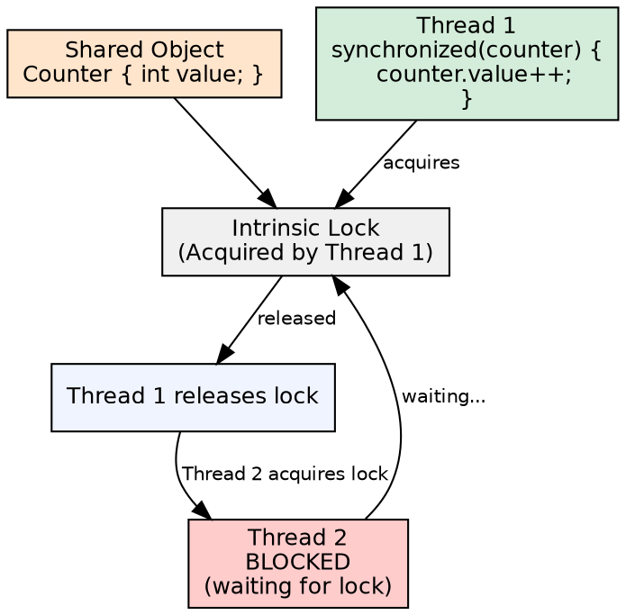
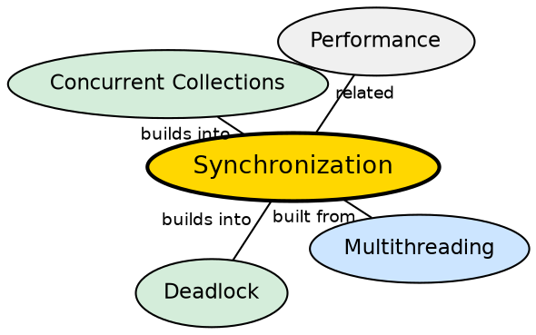

## The Problem

When multiple threads access shared mutable data simultaneously, race conditions occur — two threads reading and writing the same variable can interleave in unpredictable ways, producing incorrect results. Without coordination, concurrent programs are unreliable.

## Core Idea

**Synchronization** coordinates access to shared resources among threads. Java provides the `synchronized` keyword (which uses intrinsic locks/monitors), the `volatile` keyword (for visibility guarantees), and the `java.util.concurrent.locks` package (explicit Lock, ReentrantLock, ReadWriteLock).

## How It Works

Every Java object has an intrinsic lock (monitor). When a thread enters a `synchronized` block or method, it acquires the object's lock. Other threads attempting to enter any synchronized block on the same object block until the lock is released. `synchronized` guarantees both mutual exclusion and visibility (happens-before).

## Visual Explanation

## Semantic Network

## Key Properties

- **Intrinsic locks**: Every Java object has a built-in monitor
- **synchronized methods**: `synchronized` on an instance method locks `this`
- **synchronized blocks**: More granular — specify the lock object explicitly
- **volatile**: Guarantees visibility (reads see latest write) but not atomicity

## Connections

- **Built from:** [[java-multithreading|Java Multithreading]] — synchronization only matters when multiple threads exist
- **Builds into:** [[java-deadlock|Java Deadlock]] — improper synchronization ordering causes deadlock
- **Builds into:** [[java-executor-framework|Java Executor Framework]] — thread pools need synchronized task queues
- **Related:** [[java-stringbuilder-stringbuffer|StringBuilder and StringBuffer]] — StringBuffer uses synchronized methods for thread safety

## Edge Cases & Gotchas

- **Double-checked locking**: Famous bug pattern — volatile fixes it in Java 5+
- **Synchronized is reentrant**: The same thread can acquire the same lock multiple times without blocking
- **Performance cost**: Synchronized blocks have overhead — use for the smallest scope needed
- **Lock starvation**: Low-priority threads may never acquire a contended lock