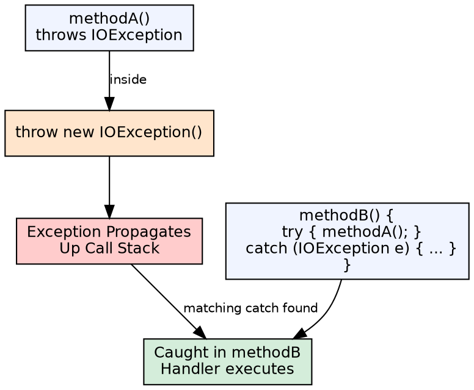
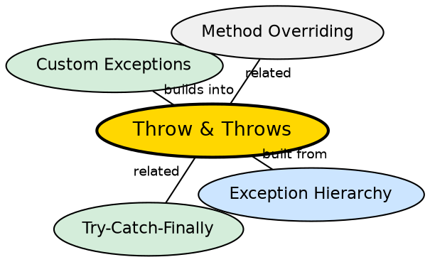

## The Problem

Not every method can handle every error that occurs within it. Sometimes the right response is to notify the caller that something went wrong and let the caller decide how to handle it. Without a standard way to declare and propagate exceptions, error information would be lost.

## Core Idea

The `throw` keyword manually creates and throws an exception. The `throws` keyword in a method signature declares that the method may throw one or more checked exceptions, letting callers know what to expect. `throw` is used inside the method body; `throws` is part of the method declaration.

## How It Works

When `throw new SomeException()` executes, the JVM unwinds the call stack looking for a matching `catch` block. The `throws` clause in the method signature is a compile-time contract: callers must either catch the declared exceptions or add them to their own `throws` clause.

## Visual Explanation

## Semantic Network

## Key Properties

- **throw**: Takes a Throwable instance (or subclass), never returns normally
- **throws**: Lists checked exception types a method may propagate
- **RuntimeException**: Does not need `throws` — unchecked by design
- **Override rules**: Subclass method cannot throw a broader checked exception than the parent override

## Connections

- **Built from:** [[java-exception-hierarchy|Java Exception Hierarchy]] — throw works with any Throwable subclass
- **Builds into:** [[java-custom-exceptions|Custom Exceptions]] — custom exceptions are thrown with `throw`
- **Contrasts with:** [[java-try-catch-finally|Try-Catch-Finally]] — throw propagates; try-catch handles
- **Related:** [[java-polymorphism|Java Polymorphism]] — method overriding has specific throws clause constraints

## Edge Cases & Gotchas

- **Throws for RuntimeException**: Legal but pointless — the compiler doesn't enforce it
- **Overriding and throws**: Subclass cannot add new checked exception types to throws clause
- **Exception chaining**: Use `throw new Cause(e)` or `initCause()` to wrap exceptions
- **throws Exception**: Too broad — defeats the purpose of checked exceptions