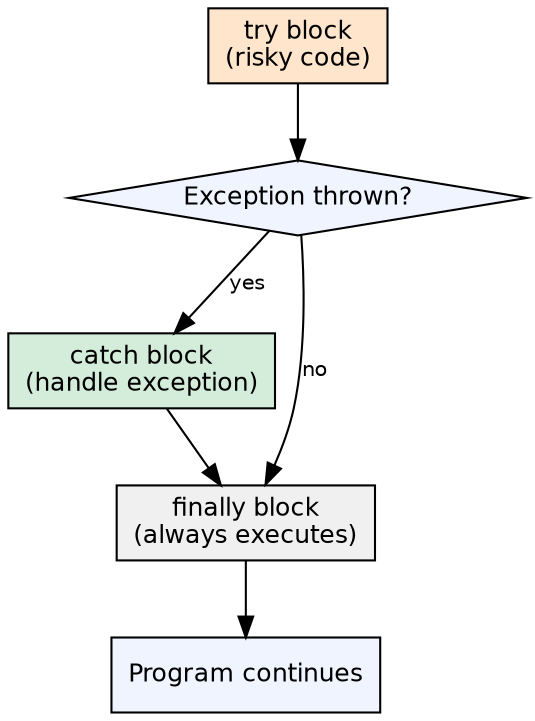
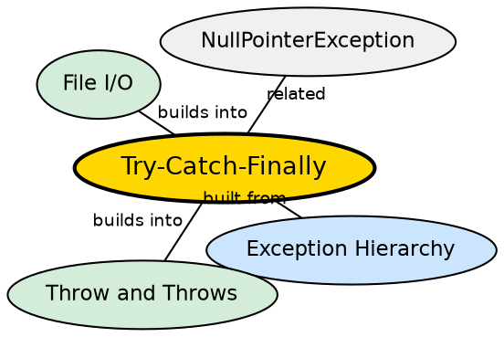

## The Problem

When an exception is thrown, normal execution stops and the stack unwinds. Without a structured way to catch exceptions, every method would need to propagate errors manually — and resources (files, sockets, database connections) opened before the exception would leak.

## Core Idea

The `try-catch-finally` block is Java's mechanism for handling exceptions. Code that might throw is placed in the `try` block. Exceptions are caught and handled in `catch` blocks. The `finally` block (optional) always executes, regardless of whether an exception occurred — making it ideal for resource cleanup.

## How It Works

When code in a `try` block throws an exception, the JVM checks the associated `catch` blocks in order. The first `catch` whose parameter type matches the exception (or is a superclass) executes. After the `catch` block, control moves to `finally` (if present). If no `catch` matches, the exception propagates up the call stack.

## Visual Explanation

## Semantic Network

## Key Properties

- **Multi-catch** (Java 7+): `catch (IOException | SQLException e)` — handle multiple types in one block
- **Try-with-resources** (Java 7+): Auto-closes `AutoCloseable` resources — no finally needed
- **finally always runs**: Even if try has `return`, catch throws another exception, or no exception at all
- **Single catch per try**: Only one catch block executes (the first matching one)

## Connections

- **Built from:** [[java-exception-hierarchy|Java Exception Hierarchy]] — catch blocks match based on exception type
- **Builds into:** [[java-file-handling|Java File Handling]] — file operations commonly use try-with-resources
- **Builds into:** [[java-jdbc|Java JDBC]] — database connections use try-catch-finally for resource cleanup
- **Related:** [[java-throw-throws|Throw and Throws]] — throwing exceptions vs handling them

## Edge Cases & Gotchas

- **finally overrides return**: If both try and finally have `return`, finally's return wins (usually a bug)
- **System.exit() bypasses finally**: Calling `System.exit()` in try prevents finally from running
- **Catching too broadly**: `catch (Exception e)` catches RuntimeException too — masks bugs
- **Resource leak**: Pre-Java 7, forgetting to close resources in finally caused leaks

## Sources

- [[java1-summary|Java Tutorial — Source Summary]] — exception handling
